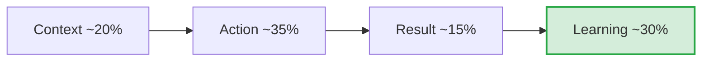

# CARL Methodology Specification: Executive Reflection & Systemic Learning
**The-Plan-Software Communication Engine: Cognitive Architecture & Jev Wire Catalog**

---

## 1. Executive Summary & Why CARL Exists

While the **STAR** framework evaluates past execution and task delivery, senior and leadership roles demand an even more critical capability: **metacognition, intellectual humility, and systemic learning**. 

The **CARL Framework** (**Context, Action, Result, Learning**) is the executive standard for evaluating how a professional handles failures, unexpected pivots, architectural trade-offs, and organizational growth. In tier-1 engineering and leadership assessments (Senior, Staff, Principal, Director), interviewers specifically listen to the **Learning** phase to determine whether a candidate has 10 years of evolving experience or simply 1 year of experience repeated 10 times.



### Key Differences Between STAR and CARL
| Dimension | STAR (Situation, Task, Action, Result) | CARL (Context, Action, Result, Learning) |
| :--- | :--- | :--- |
| **Primary Focus** | Task completion, problem solving, individual agency. | Metacognition, failure recovery, systemic resilience. |
| **Target Seniority** | Mid-level, Senior Engineer, Individual Contributor. | Senior, Staff, Principal, Engineering Manager, Director. |
| **Narrative Climax** | The **Result** (the deliverable, metric, or resolution). | The **Learning** (the shift in mental models and permanent safeguards). |
| **Ideal Prompt Types** | *"Tell me about a time you shipped a hard project."* | *"Tell me about a time an assumption you made was wrong."* |
| **Time Allocation** | 15% S, 15% T, 55% A, 15% R | 15–20% C, 35% A, 15% R, **25–30% L** |

---

## 2. Core Evaluation Principles & Realistic Nuances

### Principle 1: The "Learning" is the True Climax
* In STAR, once the Result is shared, the story concludes. 
* In CARL, the Result is merely the setup for the most important phase: **the Learning**. If a speaker spends 90 seconds detailing technical actions and concludes with a 5-second generic quip (*"And so I learned to always test my code"*), the answer is an **incomplete failure**.
* The Learning must account for **25% to 30%** of the answer's duration and depth.

### Principle 2: Systemic Learning vs. Superficial Platitudes
* **Weak (Superficial Platitude):** *"I learned that communication is really important across teams."* (Tells the interviewer nothing about technical depth or executive maturity).
* **Strong (Systemic Safeguards):** *"That incident showed me that our staging environment completely masked lock contention because synthetic data lacked real-world skew. As a result, I permanently altered our engineering playbook: we instituted automated chaos runs with production-cloned distributions, and I created a post-mortem review template now used across all four squads."*

### Principle 3: Authentic Humility Over Defensive Externalization
* In failure, outage, or pivot prompts, interviewers explicitly test for **defensive externalization** (blaming management, legacy code, juniors, or shifting deadlines).
* Candidates who openly own their misjudgments (*"My assumption at the time was X, which was flawed because I overlooked Y"*) demonstrate emotional maturity and psychological safety.

### Principle 4: Balanced Result & Impact (Quantitative & Operational)
* As established in our core philosophy, results do **not** need to be solely numeric percentages.
* **Valid Quantitative Results:** *"We recovered database throughput within 45 minutes, limiting downtime to 0.02%."*
* **Valid Qualitative/Operational Results:** *"We unblocked the mobile release branch, re-established trust with our enterprise banking partner, and eliminated a high-risk architectural single-point-of-failure."*

---

## 3. Generative Scenario Engine for CARL (Gemini API)

CARL scenarios are deliberately crafted to introduce tension, unexpected friction, or flawed initial assumptions.

### 3.1 System Prompt for Gemini
```text
You are the Scenario Architect for an executive leadership and communication platform.
Your task is to generate realistic, high-stakes interview scenarios specifically tailored for the CARL (Context, Action, Result, Learning) framework.

Target Framework: CARL
User Domain: {user_domain}
Difficulty: {difficulty_level}
Focus Theme: {focus_theme}

Output a strictly typed JSON object:
{
  "scenario_id": "unique_kebab_slug",
  "title": "Short 3-5 word title",
  "context_background": "2-3 sentences setting up the organizational setting, the initial decision made, and the unexpected roadblock or failure that emerged.",
  "prompt_question": "The exact question spoken by the interviewer or executive.",
  "target_dimensions": [
    "Willingness to own misjudgments without external blame",
    "Evidence of permanent systemic/architectural learning"
  ],
  "target_duration_seconds": 100
}

Rules:
1. Ground scenarios in authentic engineering trade-offs (e.g., premature optimization, tech debt vs feature velocity, underestimated migration complexity, blind spots in incident response).
2. The question must explicitly invite reflection on setbacks, assumptions, or pivotal learnings.
```

### 3.2 Sample CARL Scenarios
* **Scenario A (Staff Engineer - Architectural Blindspot):**
  * *Context:* "You championed an asynchronous event-driven microservices architecture to replace an aging monolith. Six months in, operational complexity, distributed tracing overhead, and eventual consistency bugs severely degraded developer velocity."
  * *Prompt:* *"Tell me about a significant architectural decision you advocated for that failed to meet expectations or caused major friction. What went wrong, and how did that experience evolve your architectural philosophy?"*
* **Scenario B (Engineering Manager - People & Delegation):**
  * *Context:* "You delegated a critical compliance security refactor to a promising engineer without sufficient staging review gates. A bug slipped into production on launch day."
  * *Prompt:* *"Describe a time when your delegation or oversight of a project broke down. What was the impact, and what structural safeguards did you put in place to ensure it never happened again?"*

---

## 4. Jev System One Wire Catalog: Comprehensive CARL Suite

Below is the complete, criteria-rich specification for evaluating a CARL response using TypeSafe AI's Jev model.

### 4.1 State Structure
```json
{
  "scenario_prompt": "Tell me about a time a major technical decision you made turned out to be flawed. How did you handle the fallout, and what did that experience teach you?",
  "scenario_context": "Senior Backend Engineer; Redis cache cluster invalidation bug under Black Friday load.",
  "target_framework": "CARL",
  "speaker_role": "Senior Backend Engineer",
  "transcript": "Two years ago at PaySync, I led our migration to a multi-region Redis cache...",
  "word_count": 290,
  "duration_seconds": 115,
  "words_per_minute": 151
}
```

---

### 4.2 The Six Core CARL Questions Submitted to Jev

> **Cross-cutting clarity:** in addition to the framework questions below, every catalog includes the two shared
> clarity/ambiguity questions (`clarity_of_response`, `ambiguity_presence`), graded as a standalone metric that does
> not affect the composite score. See [clarity.md](./clarity.md).

#### Question 1: `carl_context_framing` (Primitive: `choice`)
```json
{
  "type": "choice",
  "instructions": "Evaluate whether the speaker in `transcript` establishes a concrete, credible Context for the scenario in response to `scenario_prompt`. The Context must set the stage: identifying the organizational setting, the technical or business goal, the initial premise or assumption, and the stakes. Do NOT demand exhaustive company histories; simple, credible grounding in a real past event is sufficient. Distinguish authentic past experiences from generic or hypothetical lecturing.",
  "criteria": {
    "well_framed_context": "The speaker clearly grounds the narrative in an authentic past context. Identifies the organization, system, project, initial technical goal, and the baseline assumption that was in place before the complication arose. Concise and setting the stage without taking over the entire answer.",
    "partially_framed": "The speaker establishes a real past scenario with minimal details (e.g., 'At my previous company, we decided to adopt GraphQL...'). The baseline context is clear, though light on operational scale or initial constraints.",
    "hypothetical_or_generic": "The speaker answers in theoretical terms ('When building microservices, people often make the mistake of...') rather than recounting a specific past event that they actually experienced.",
    "absent": "The speaker provides zero context, launching into actions or lessons with no explanation of where, when, or why the event took place.",
    "unable_to_assess": "Transcript is severely garbled, corrupt, or unintelligible."
  }
}
```

#### Question 2: `carl_action_ownership_and_rigor` (Primitive: `score`)
```json
{
  "type": "score",
  "instructions": "Assess the candidate's personal ownership, agency, and technical depth in the Action component of `transcript`. Evaluate what the candidate personally investigated, decided, designed, or executed when the complication or failure emerged. Distinguish between healthy team collaboration (which is valued) versus hiding behind a passive 'we' where individual contribution is obscured. Look for first-person active verbs ('I profiled', 'I realized', 'I proposed', 'I refactored'), technical specifics, and honest ownership of decisions.",
  "criteria": {
    "Level 1": "Passive / Obscured Contribution: Uses passive or collective language exclusively ('we realized', 'it was decided', 'a fix was deployed'). Impossible to isolate the candidate's personal agency. Descriptions are vague and lack technical rigor.",
    "Level 2": "Weak Ownership: The narrative is predominantly team-centric with minor incidental participation ('I was part of the war room', 'I helped review the rollback'). Shows minimal individual troubleshooting or leadership.",
    "Level 3": "Adequate Ownership & Clear Action: Clear separation between team responsibilities and personal actions. The candidate explains what they personally did to investigate the issue and stabilize the system, though technical trade-offs are light.",
    "Level 4": "Strong Problem-Solving & Technical Depth: Decisive first-person ownership. The candidate details specific diagnostic tools, architectural triage, and proactive containment steps they spearheaded. Transparently articulates their thinking during the crisis.",
    "Level 5": "Exemplary Leadership & Composure: Outstanding execution under high pressure. The candidate details how they stabilized the immediate failure, transparently managed stakeholder communication, coordinated remediation, and led technical troubleshooting without panic or defensiveness."
  }
}
```

#### Question 3: `carl_result_and_impact` (Primitive: `choice`)
```json
{
  "type": "choice",
  "instructions": "Assess the Result component in `transcript`. Evaluate whether the response details a tangible, identifiable outcome. Crucially: DO NOT penalize the candidate if the result is not expressed as a numeric percentage. Both quantitative metrics (e.g., 'restored service in 18 minutes', 'kept data loss to zero') AND meaningful qualitative/operational outcomes (e.g., 'unblocked the client rollout', 'prevented database corruption by halting the batch job', 'rebuilt trust with the ops team') are fully valid representations of impact. Distinguish real outcomes from vague, unresolved endings.",
  "criteria": {
    "quantified_metric_impact": "Result includes concrete numerical data points (e.g., 'recovered service in 14 minutes', 'reduced memory footprint by 40%', 'retained 99.95% of transactions during the failover').",
    "meaningful_qualitative_impact": "Result delivers clear operational, strategic, technical, or relational impact without numbers (e.g., 'stabilized the cluster and prevented cascading outages', 'unblocked the pending customer launch', 'successfully migrated users without data loss', 'salvaged relationship with an at-risk enterprise customer'). Represents a real, observable difference.",
    "weak_or_vague_outcome": "An outcome is mentioned, but it is superficial or unsubstantiated without clear evidence of value (e.g., 'things eventually settled down', 'it was basically okay in the end').",
    "absent_or_unresolved": "No result is provided. The speaker jumps directly from actions to lessons without stating what actually happened to the immediate problem, or leaves the narrative unresolved.",
    "unable_to_assess": "Transcript is garbled or cut off."
  }
}
```

#### Question 4: `carl_learning_metacognitive_depth` (Primitive: `score`)
```json
{
  "type": "score",
  "instructions": "Evaluate the Learning component in `transcript`—the defining climax of the CARL framework. Assess the candidate's metacognition, intellectual maturity, and systemic growth. Does the speaker identify an underlying flawed assumption, explain how their mental models changed, and describe concrete, lasting systemic safeguards (e.g. new testing gates, architecture principles, automated checks, runbooks) instituted across the team? Penalize shallow clichés or defensive blaming.",
  "criteria": {
    "Level 1": "Defensive / Externalized Blame: Zero genuine learning. The speaker blames external factors (juniors, legacy code, unrealistic deadlines, bad product managers) and takes zero psychological ownership of the outcome.",
    "Level 2": "Superficial Platitudes: Offers shallow, generic clichés with zero technical or behavioral insight (e.g., 'I learned that communication is key', 'Always double check everything', 'Teamwork makes the dream work').",
    "Level 3": "Individual Tactical Takeaway: The candidate identifies a specific mistake or assumption in retrospect and articulates what they personally do differently today on an individual level (e.g., 'I learned to never trust client-side validation alone and now always implement server-side rate limits').",
    "Level 4": "Systemic Process & Engineering Improvement: High maturity. The candidate explains how the incident permanently upgraded their team's engineering standards, tooling, or institutional protocols (e.g., 'We instituted an automated chaos testing canary in CI', 'I authored an RFC template requiring data migration rollback plans for all stateful services').",
    "Level 5": "Transformational Organizational Wisdom: Exceptional metacognitive depth and leadership. The candidate connects the specific technical lesson to broad strategic philosophy, cultural resilience, and proactive organization-wide knowledge dissemination, demonstrating profound long-term growth."
  }
}
```

#### Question 5: `carl_narrative_balance` (Primitive: `choice`)
```json
{
  "type": "choice",
  "instructions": "Evaluate the narrative pacing and proportional balance of `transcript` against the CARL standard (approx. 20% Context, 35% Action, 15% Result, 30% Learning). In CARL, the Learning is the primary deliverable: check whether the speaker allocated sufficient time and depth to meaningful reflection, or whether they rushed through the learning in the final 5 seconds as an afterthought.",
  "criteria": {
    "rich_learning_climax": "Well-balanced pacing with deep reflection. The speaker gives a clean setup and reserves a substantial portion (~25-30%) of the answer to articulate deep, mature learnings and systemic improvements.",
    "rushed_afterthought_learning": "Severely unbalanced. The candidate spends 90% of their time on context and actions, cramming the learning into a single hurried sentence in the final 5 seconds.",
    "context_heavy_history_lecture": "The speaker spends over half of their time describing background context, company politics, or system lore, leaving little time for both actions and learning.",
    "disorganized_or_rambling": "Lacks structural flow. Jumps erratically between timelines, digresses into unrelated topics, and loses the thread of the prompt."
  }
}
```

#### Question 6: `carl_vulnerability_and_humility` (Primitive: `choice`)
```json
{
  "type": "choice",
  "instructions": "Assess the psychological stance and emotional maturity of the speaker in `transcript`. In executive interviews, leaders evaluate whether a candidate possesses the security to openly discuss errors, miscalculations, and lessons, or whether they present an inflated, bulletproof persona.",
  "criteria": {
    "authentic_humility_and_ownership": "The speaker is completely candid, balanced, and confident in discussing mistakes. Takes calm ownership of misjudgments without self-flagellation or defensive excuse-making.",
    "guarded_or_reluctant": "The speaker frames the story such that they never actually made a real mistake; excuses are peppered throughout ('I only did it because someone told me to').",
    "defensive_or_arrogant": "The speaker exhibits arrogance or hostility, minimizing real failures or projecting an infallible persona."
  }
}
```

---

## 5. Deterministic Scoring & Real-Time Coaching Engine (CARL)

Because CARL prioritizes metacognition, the **Learning** component carries the heaviest weight in the composite score.

### 5.1 CARL Composite Score Formulation

$$Score_{\text{CARL}} = (W_C \times P_C) + (W_A \times S_A) + (W_R \times P_R) + (W_L \times S_L) + (W_B \times P_B)$$

* **Context Framing ($W_C = 15\%$):**
  * `well_framed_context` = $1.0$
  * `partially_framed` = $0.75$
  * `hypothetical_or_generic` = $0.2$
  * `absent` = $0.0$
* **Action Ownership & Rigor ($W_A = 25\%$):**
  * Normalized Score: $\frac{\text{Level}}{5.0}$
* **Result & Impact ($W_R = 15\%$):**
  * `quantified_metric_impact` = $1.0$
  * `meaningful_qualitative_impact` = **$1.0$ (Full Credit for Real Impact)**
  * `weak_or_vague_outcome` = $0.3$
  * `absent_or_unresolved` = $0.0$
* **Metacognitive Learning Depth ($W_L = 35\%$ — Heaviest Weight!):**
  * Level 5 = $1.0$
  * Level 4 = $0.85$
  * Level 3 = $0.65$
  * Level 2 = $0.30$
  * Level 1 = $0.0$
* **Narrative Balance ($W_B = 10\%$):**
  * `rich_learning_climax` = $1.0$
  * `rushed_afterthought_learning` = $0.4$
  * `context_heavy_history_lecture` = $0.3$
  * `disorganized_or_rambling` = $0.1$

---

### 5.2 Real-Time Coaching Triggers (CARL Specific)

| Jev Evaluation Trigger | UI Badge | Deterministic Coaching Advice |
| :--- | :--- | :--- |
| `carl_learning_metacognitive_depth.choice >= "Level 4"` | 🌟 **Systemic Wisdom** | *"Outstanding executive reflection. You demonstrated how a single failure led to permanent, team-wide safeguards and architectural improvements."* |
| `carl_learning_metacognitive_depth.choice == "Level 2"` | ⚠️ **Superficial Learning** | *"Your learning was clichéd ('communication is key'). Senior interviewers look for systemic takeaways: what specific engineering gate, runbook, or architectural rule did you institute?"* |
| `carl_learning_metacognitive_depth.choice == "Level 1"` | 🚨 **Defensive Blame Alert** | *"You externalized blame onto teammates or legacy tooling. Executive maturity requires psychological ownership: clearly state what assumption YOU personally got wrong."* |
| `carl_narrative_balance.choice == "rushed_afterthought_learning"` | ⏱️ **Rushed Reflection** | *"You spent 90% of your time on the story and rushed the learning in the final seconds. In the CARL framework, reserve the final 30–45 seconds exclusively for reflection and takeaways."* |
| `carl_vulnerability_and_humility.choice == "guarded_or_reluctant"` | 🛡️ **Guarded Persona** | *"You hedged your answers to avoid admitting a mistake. Interviewers respect confident candor: frame the setback as a valuable investment in your technical maturity."* |
| `carl_result_and_impact.choice == "meaningful_qualitative_impact"` | ✅ **High Operational Impact** | *"Great articulation of qualitative impact. You clearly showed how service stability and team alignment were restored."* |
