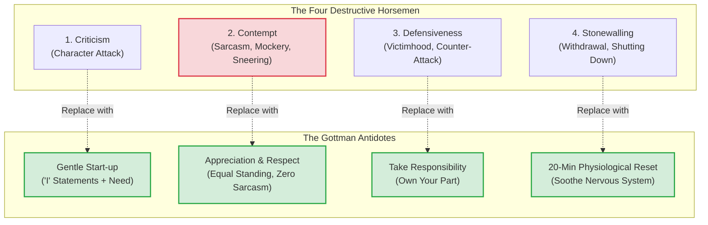

# Gottman De-escalation Methodology Specification: Conflict De-escalation & The Four Horsemen
**The-Plan-Software Communication Engine: Cognitive Architecture & Jev Wire Catalog**

---

## 1. Executive Summary & Why Gottman De-escalation Exists

In high-stakes technical ventures, co-founder conflicts, and executive disagreements, intelligence does not prevent relationship destruction. Technical partners who agree on architecture frequently fail because they enter toxic interpersonal combat when under pressure.

The **Gottman De-escalation Framework** was developed by Dr. John Gottman and Dr. Julie Schwartz Gottman (The Gottman Institute). Built on 40+ years of longitudinal laboratory research with a **>90% predictive accuracy** for relationship and partnership outcomes, it is the most empirically verified interpersonal conflict model in psychological science. Extensively documented and integrated in Nasir's *The Plan* (Sections 2.2.4, 2.2.9, 3.4.4, & 3.4.9), this protocol translates clinical relationship science into an operational playbook for workplace conflict, co-founder deadlocks, and emotional regulation.



---

## 2. The Four Horsemen and Their Antidotes

### Horseman 1: Criticism $\rightarrow$ Antidote: Gentle Start-up
* **The Toxic Marker:** Attacking the person's character, personality, or core identity rather than addressing a specific behavior (*"You are so disorganized, careless, and lazy"*).
* **The Antidote (Gentle Start-up Formula):**
  $$\text{"I feel [Emotion] about [Specific Event]. I need [Positive Need]."}$$
  * *Example:* *"I feel overwhelmed when database migrations are deployed without staging tests. I need us to walk through the deployment runbook together."*

### Horseman 2: Contempt $\rightarrow$ Antidote: Culture of Appreciation & Equal Standing
* **The Toxic Marker:** Sarcasm, cynicism, name-calling, eye-rolling, sneering, mocking humor, or condescending put-downs. Gottman's research proved that **Contempt is the #1 predictor of partnership dissolution and divorce**. It conveys disgust and moral superiority.
* **The Antidote:** Zero tolerance for mockery. Speak from an equal, respectful baseline. Acknowledge the counterpart's past contributions and treat them as an intellectual equal.

### Horseman 3: Defensiveness $\rightarrow$ Antidote: Accepting Responsibility
* **The Toxic Marker:** Playing the blameless victim, making endless excuses, or instantly counter-attacking (*"I wouldn't have missed the release date if your specifications weren't completely incompetent!"*). Defensiveness escalates conflict because the counterpart feels unheard.
* **The Antidote:** Own your piece of the problem—even if it represents only 5% of the fault.
  * *Example:* *"You make a fair point. I should have flagged that API bottleneck earlier in the week before it delayed the release."*

### Horseman 4: Stonewalling $\rightarrow$ Antidote: Physiological Self-Soothing & Time-out
* **The Toxic Marker:** Tuning out, turning away, folding arms, non-responsiveness, or abruptly exiting the room. Stonewalling occurs when a person experiences **diffuse physiological arousal (flooding)**: heart rate exceeding 100 BPM, adrenaline release, and cognitive tunnel vision.
* **The Antidote:** Call a structured, respectful 20-minute time-out to lower heart rate, with a firm commitment to return.
  * *Example:* *"I'm feeling flooded right now and I want to be constructive. Let's take a 20-minute break to reset, and let's meet back at 2:30 PM to resolve this."*

---

## 3. Core Principles & Realistic Nuances

### Principle 1: Repair Attempts are the Thermostat of Conflict
* In successful partnerships and teams, conflict does not mean an absence of friction; it is defined by **the frequency and acceptance of Repair Attempts**.
* A Repair Attempt is any verbal or emotional gesture that de-escalates tension:
  * *"Can I take that back? That came out harsher than I intended."*
  * *"Can we pause for a second? I want to make sure I'm hearing you."*
  * *"I hear what you're saying, and you're right about that part."*
* High-scoring communicators actively issue and receive repair attempts.

### Principle 2: Soft Start-up Dictates the Outcome
* Gottman's research demonstrated that **96% of conversations end on the exact same emotional trajectory in which they began in the first 3 minutes**.
* A harsh start-up guarantees a hostile ending. A soft start-up keeps the nervous system calm and enables collaborative problem-solving.

### Principle 3: The 5:1 Magic Ratio
* During healthy conflict, resilient partnerships maintain at least **5 positive interactions (validations, nods, appreciations, active listening) for every 1 negative interaction (critique, disagreement)**.

---

## 4. Generative Scenario Engine for Gottman De-escalation (Gemini API)

Gottman scenarios simulate high-stress interpersonal flare-ups where emotional flooding and hostility threaten partnership continuity.

### 4.1 System Instruction for Gemini
```text
You are the Scenario Architect for an executive leadership communication platform.
Your task is to generate emotionally volatile, high-stakes dispute scenarios designed specifically to test Gottman De-escalation and Four Horsemen countermeasures.

Target Framework: GOTTMAN
User Domain: {user_domain}
Difficulty: {difficulty_level}
Focus Theme: {focus_theme}

Output a strictly typed JSON object:
{
  "scenario_id": "unique_kebab_slug",
  "title": "Short 3-5 word title",
  "context_background": "2-3 sentences detailing an intense dispute where a co-founder, executive, or lead engineer is visibly agitated, accusatory, or attacking.",
  "prompt_question": "The angry opening outburst spoken by the counterpart.",
  "key_success_factors": [
    "Zero Contempt or Defensive counter-attacks",
    "Deployment of a Gentle Start-up or De-escalating Repair Attempt",
    "Acceptance of personal responsibility for part of the problem"
  ],
  "target_duration_seconds": 90
}

Rules:
1. Ground scenarios in real venture crises: e.g., an outage during fundraising, an equity disagreement, blown deadlines, or conflicting product visions.
2. The prompt_question must contain an aggressive, accusatory lead (e.g., 'You completely dropped the ball! Do you even know what you are doing?').
```

### 4.2 Sample Gottman Scenarios
* **Scenario A (Co-Founder Dispute - Outage During Investor Demo):**
  * *Context:* "Your technical co-founder is furious after a demo with tier-1 venture capitalists crashed. They storm into the private conference room."
  * *Prompt:* *"Your co-founder shouts: 'You promised me that build was stable! You humiliated us in front of the board! You are completely incompetent when it matters most!' How do you de-escalate this conflict using the Gottman framework?"*
* **Scenario B (VP of Engineering to Lead Architect - Blown Deadline):**
  * *Context:* "A critical customer migration deadline was missed, and the VP of Sales is threatening to cancel the contract."
  * *Prompt:* *"The VP of Sales snaps: 'Your engineering team has no sense of urgency. You don't care about revenue or the survival of this company!' Respond using Gottman countermeasures."*

---

## 5. Jev System One Wire Catalog: Comprehensive Gottman Suite

Below is the complete, criteria-rich specification for evaluating a user's Gottman de-escalation response using TypeSafe AI's Jev model.

### 5.1 State Structure
```json
{
  "scenario_prompt": "Your co-founder shouts: 'You promised me that build was stable! You humiliated us in front of the board! You are completely incompetent when it matters most!' De-escalate using Gottman principles.",
  "scenario_context": "Co-founder furious over investor demo crash; volatile emotional flooding; heavy Criticism and Contempt in counterpart's prompt.",
  "target_framework": "GOTTMAN",
  "speaker_role": "Technical Co-Founder",
  "transcript": "Tunde, take a breath with me for a second [Repair Attempt]. I completely understand why you are furious—today was our biggest pitch, and having the service fail on us was devastating [Validation]. You are right that I assured you the build was ready, and I take full responsibility for not doing a live canary test on the hotel Wi-Fi before the meeting [Accept Responsibility]. I need us to resolve this as partners, not tear each other down [Gentle Start-up]. Let's step away for 15 minutes to cool down our adrenaline, and then let's diagnose the crash logs together [Physiological Reset].",
  "word_count": 102,
  "duration_seconds": 48,
  "words_per_minute": 127
}
```

---

### 5.2 The Six Core Gottman Questions Submitted to Jev

> **Cross-cutting clarity:** in addition to the framework questions below, every catalog includes the two shared
> clarity/ambiguity questions (`clarity_of_response`, `ambiguity_presence`), graded as a standalone metric that does
> not affect the composite score. See [clarity.md](./clarity.md).

#### Question 1: `gottman_four_horsemen_marker` (Primitive: `choice`)
```json
{
  "type": "choice",
  "instructions": "Conduct a rigorous forensic screening of `transcript` for Dr. John Gottman's Four Horsemen of communication breakdown: Criticism, Contempt, Defensiveness, and Stonewalling. Contempt (sarcasm, mockery, sneering, hostile eye-rolling language) is the most destructive marker and must receive the heaviest penalty.",
  "criteria": {
    "none_clean_de_escalated": "Zero destructive markers. The speaker responds with emotional self-control, dignity, composed authority, and active de-escalation.",
    "contempt_detected": "Severe Failure: The speaker exhibits mockery, sarcasm, patronizing put-downs, hostile humor, or sneering superiority (e.g., 'Oh, like you've never made a mistake?', 'Brilliant deduction, genius').",
    "criticism_detected": "The speaker counter-attacks the person's character, personality, or competence rather than addressing the specific issue (e.g., 'You are so paranoid and irrational').",
    "defensiveness_detected": "The speaker plays the blameless victim, makes excuses, or immediately counter-attacks (e.g., 'Don't blame me! You didn't give me the latest pitch deck so how was I supposed to know?').",
    "stonewalling_detected": "The speaker shuts down emotionally, offers passive-aggressive one-word dismissals, or displays cold indifference."
  }
}
```

#### Question 2: `gottman_soft_startup_presence` (Primitive: `noul`)
```json
{
  "type": "noul",
  "instructions": "Determine whether the speaker in `transcript` utilizes Gottman's 'Gentle Start-up' technique. A Gentle Start-up begins without blame or character attacks; it uses 'I' statements to express feelings about a specific situation and clearly states a positive need (e.g., 'I feel overwhelmed when...', 'I need us to focus on solving this as partners').",
  "criteria": {
    "yes": "The speaker opens or frames their response using gentle, non-hostile language, expressing feelings and positive needs without character attacks.",
    "no": "The speaker opens with a harsh start-up, accusatory statements, defensiveness, or character judgments."
  }
}
```

#### Question 3: `gottman_responsibility_acceptance` (Primitive: `score`)
```json
{
  "type": "score",
  "instructions": "Assess the candidate's willingness to Accept Responsibility in `transcript`. In Gottman de-escalation, defensiveness is neutralized when one party has the emotional security to acknowledge their part of the friction (even if small), validating the counterpart's reality instead of offering reflexive excuses.",
  "criteria": {
    "Level 1": "Total Defensiveness / Blameless Victimhood: Zero accountability. The speaker makes excuses, blames external circumstances, and denies any role in the issue.",
    "Level 2": "Grudging / Hedged Admission: Admits a minor fact but immediately waters it down with defensive caveats ('Fine, I didn't test it, BUT you pushed me to rush').",
    "Level 3": "Adequate Ownership: Openly acknowledges their mistake or oversight without making counter-excuses.",
    "Level 4": "Strong Generous Ownership: Validates the other party's frustration and takes clear, unambiguous responsibility for their contribution to the breakdown.",
    "Level 5": "Masterful Emotional Leadership: Exemplary maturity. Validates the counterpart's experience with deep empathy, calmly owns their part of the breakdown, and shifts the dynamic from blame to collaborative remediation."
  }
}
```

#### Question 4: `gottman_repair_attempt_usage` (Primitive: `choice`)
```json
{
  "type": "choice",
  "instructions": "Evaluate whether the speaker introduces an active, de-escalating Repair Attempt in `transcript`. A Repair Attempt is any verbal gesture that cools emotional temperature, de-escalates tension, or restores connection (e.g., 'Can we take a breath?', 'I hear you, and you're right about that', 'Can I step back for a second?').",
  "criteria": {
    "active_repair_attempt_used": "The speaker actively deploys an unmistakable repair attempt to de-escalate tension and restore emotional safety.",
    "missed_or_escalated": "The speaker matches the counterpart's anger, escalating the conflict with heightened aggression or dismissiveness.",
    "not_applicable_steady": "The conversation remained calm enough that a dramatic repair attempt was not necessary."
  }
}
```

#### Question 5: `gottman_flooding_awareness_timeout` (Primitive: `choice`)
```json
{
  "type": "choice",
  "instructions": "Determine whether the speaker recognizes psychological and physiological flooding (elevated heart rate, cognitive tunnel vision) and offers a calm, structured time-out (approx. 20 minutes) with an explicit commitment to return and resolve the issue.",
  "criteria": {
    "structured_timeout_called": "The speaker calmly identifies high emotional arousal and proposes a structured short break (e.g., 15–20 minutes) with a firm commitment to return and resolve the issue.",
    "abrupt_stormout_or_abandonment": "The speaker storms off, hangs up, or abruptly leaves without establishing a return time (Stonewalling).",
    "in_session_de_escalation": "The speaker successfully de-escalates the dialogue in real time without needing a full timeout."
  }
}
```

#### Question 6: `gottman_validation_of_counterpart` (Primitive: `score`)
```json
{
  "type": "score",
  "instructions": "Assess whether the speaker validates the emotional reality and perspective of the counterpart in `transcript`. Validation does not mean agreeing with every factual detail; it means acknowledging that the counterpart's feelings are understandable given what occurred ('I understand why you are so upset', 'That makes complete sense that you felt embarrassed').",
  "criteria": {
    "Level 1": "Invalidating & Dismissive: Gaslights, mocks, or dismisses their feelings ('You are being completely crazy', 'You are overreacting').",
    "Level 2": "Cold / Ignored: Ignores the emotional dimension entirely; responds with cold, detached, robotic technical logic.",
    "Level 3": "Basic Acknowledgment: Politely acknowledges their anger, but quickly pivots to facts.",
    "Level 4": "Strong Empathic Validation: Clearly articulates understanding of why the counterpart feels aggrieved or stressed, diffusing emotional heat.",
    "Level 5": "Masterful Tactical De-escalation: Deeply empathizes with the counterpart's emotional stakes, making them feel completely seen, heard, and understood before touching logistics."
  }
}
```

---

## 6. Deterministic Scoring & Real-Time Coaching Engine (Gottman)

In Gottman De-escalation, the presence of **Contempt** is a catastrophic zero-multiplier, while **Accepting Responsibility** ($30\%$) and **Emotional Validation** ($25\%$) drive high marks.

### 6.1 Gottman Composite Score Formulation

$$Score_{\text{Gottman}} = \text{Penalty}_{\text{Horsemen}} \times \left[ (W_R \times S_R) + (W_V \times S_V) + (W_S \times P_S) + (W_A \times P_A) + (W_T \times P_T) \right]$$

* **Horsemen Penalty Multiplier:**
  * `none_clean_de_escalated` = $1.0$
  * `defensiveness_detected` = $0.6$
  * `criticism_detected` = $0.5$
  * `stonewalling_detected` = $0.4$
  * `contempt_detected` = **$0.1$ (Catastrophic Failure Marker!)**
* **Responsibility Acceptance ($W_R = 30\%$):** Normalized Score $\frac{\text{Level}}{5.0}$.
* **Validation of Counterpart ($W_V = 25\%$):** Normalized Score $\frac{\text{Level}}{5.0}$.
* **Soft Start-up ($W_S = 15\%$):** `yes` = $1.0$, `no` = $0.2$.
* **Repair Attempt ($W_A = 15\%$):** `active_repair_attempt_used` / `not_applicable_steady` = $1.0$, `missed_or_escalated` = $0.2$.
* **Flooding / Timeout Management ($W_T = 15\%$):** `structured_timeout_called` / `in_session_de_escalation` = $1.0$, `abrupt_stormout_or_abandonment` = $0.1$.

---

### 6.2 Real-Time Coaching Triggers (Gottman Specific)

| Jev Evaluation Trigger | UI Badge | Deterministic Coaching Advice |
| :--- | :--- | :--- |
| `gottman_four_horsemen_marker.choice == "none_clean_de_escalated"` AND `gottman_responsibility_acceptance.choice >= "Level 4"` | 🕊️ **Masterful De-escalation** | *"Exemplary emotional leadership. You neutralized a volatile crisis by validating their frustration and owning your piece of the breakdown without defensiveness."* |
| `gottman_four_horsemen_marker.choice == "contempt_detected"` | 🚨 **Contempt Alert (Deadliest Marker)** | *"Detected sarcasm, mocking, or sneering language. In Gottman's research, Contempt is the #1 predictor of partnership destruction. Banish all sarcasm and address the problem as equals."* |
| `gottman_four_horsemen_marker.choice == "defensiveness_detected"` | ⚠️ **Defensive Trap** | *"You played the blameless victim or counter-attacked ('Don't blame me!'). Defensiveness escalates anger. Neutralize it by owning even 5% of the fault: 'You're right, I should have flagged that earlier'."* |
| `gottman_repair_attempt_usage.choice == "active_repair_attempt_used"` | 🧯 **Repair Attempt Deployed** | *"Great use of an active de-escalation gesture ('Can we take a breath?', 'Can I take that back?'). Repair attempts prevent arguments from spiraling."* |
| `gottman_validation_of_counterpart.choice <= "Level 2"` | ❄️ **Emotional Invalidation** | *"You dismissed their feelings ('You're overreacting'). People cannot solve problems logically until they feel heard. Validate their emotion first: 'I understand why you are so upset'."* |
| `gottman_flooding_awareness_timeout.choice == "structured_timeout_called"` | ⏱️ **Flooding Timeout Called** | *"Excellent nervous system regulation. When heart rate spikes, adrenaline prevents logic. A structured 20-minute break protects the partnership."* |
