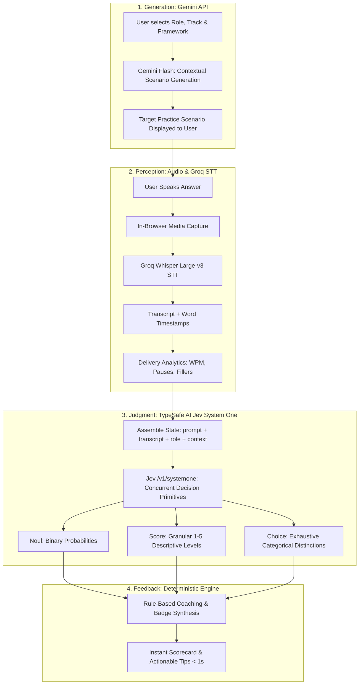

# JEV-COMMS: Communication Skills Coach Specification
**System Architecture, Framework Encyclopedia, Generative Question Engine & Comprehensive Jev Wire Catalog**

---

## 1. Executive Summary & Cognitive Architecture

Existing communication and interview coaches suffer from two critical flaws:
1. **Generative Latency & Hallucination:** Using large language models (LLMs) to grade transcripts introduces 5–10 second response delays, inconsistent scoring rubrics, and vague, conversational platitudes ("Great job! Just be more confident").
2. **Static Question Banks:** Traditional tools offer canned, repetitive prompts that fail to adapt to a user's role, seniority, or specific communication challenge.

**JEV-COMMS** solves this with a **tripartite cognitive architecture**:



### Architectural Division of Labor
| Component | Engine | Latency | Purpose |
| :--- | :--- | :--- | :--- |
| **Question Generator** | **Gemini API** (Flash / Flash-Lite) | ~600–900 ms (pre-session) | Generates dynamic, realistic, context-specific scenarios tailored to the target framework, domain, and seniority. |
| **Speech-to-Text** | **Groq API** (`whisper-large-v3`) | ~250–450 ms (post-speech) | High-accuracy transcription, word timestamps, audio duration. |
| **Delivery Analytics** | Deterministic Code | < 5 ms | Computes Words Per Minute ($WPM$), pause frequency, filler word density ("um", "uh", "like", "actually"). |
| **Evaluation Engine** | **TypeSafe AI (Jev)** | ~120–280 ms | Non-generative, typed evaluation against deeply specified, criteria-rich communication rubrics using `Choice`, `Score`, and `Noul`. |
| **Coaching Assembly** | Deterministic Rule Engine | < 10 ms | Maps Jev's typed outputs to instant badges, progress charts, and actionable sentence-level feedback. |

---

## 2. Generative Question Engine (Gemini API)

Before the user speaks, Gemini generates a realistic, tailored scenario. Both the generated scenario context and the user's spoken answer are passed into Jev's evaluation `state`.

### 2.1 Scenario Generation Contract
* **Input Parameters to Gemini:**
  * `target_framework`: `STAR` (Initial deep-dive phase)
  * `user_domain`: (e.g., "Staff Backend Engineer", "Fintech Founder", "Engineering Manager", "Technical Product Manager")
  * `difficulty_level`: `beginner` | `intermediate` | `advanced`
  * `focus_theme`: (e.g., "Production Outage", "Challenging Leadership", "Cross-Functional Friction", "Resource Constraints")

### 2.2 System Instruction for Scenario Generation (Gemini)
```text
You are the Scenario Architect for an advanced executive communication training platform.
Your objective is to generate authentic, high-stakes workplace and interview scenarios designed specifically to test the user's mastery of the STAR communication framework.

Target Framework: STAR
User Domain: {user_domain}
Difficulty: {difficulty_level}
Focus Theme: {focus_theme}

Output a strictly typed JSON object matching this schema:
{
  "scenario_id": "unique_kebab_slug",
  "title": "Short 3-5 word title",
  "context_background": "2-3 sentences setting up the organizational context, stakes, timeline, and core friction.",
  "prompt_question": "The exact question spoken by the interviewer, stakeholder, or counterpart.",
  "key_dimensions_to_test": [
    "Personal ownership of technical decisions",
    "Evidence of tangible impact (quantitative or operational/strategic)"
  ],
  "target_duration_seconds": 90
}

Operational Guidelines:
1. Ground scenarios in real-world technical and business trade-offs.
2. For 'intermediate' and 'advanced' difficulty, introduce conflicting priorities (e.g., tight deadline vs tech debt, customer satisfaction vs compliance risk).
3. Do NOT embed coaching hints or give away framework answers inside the prompt_question itself.
```

---

## 3. Deep-Dive Methodology: The STAR Framework

### 3.1 Overview & Theoretical Foundations
* **Full Name:** Situation, Task, Action, Result
* **Origin:** Developed in organizational psychology (Dr. Tom Janz, DDI) and standardized across tier-1 technology firms (Amazon Leadership Principles, Google Structured Interviews). Grounded in the behavioral axiom that structured past performance under constraints is the single highest predictor of future execution.
* **Core Philosophy:** Rather than allowing candidates to recite abstract platitudes or theoretical beliefs ("I'm a great team player who loves clean code"), STAR forces the candidate to reconstruct a factual narrative arc: **Context $\rightarrow$ Responsibility $\rightarrow$ Execution $\rightarrow$ Impact**.

---

### 3.2 Key Evaluation Principles & Realistic Nuances

#### Principle 1: Authentic Situational Grounding (Without Academic Pedantry)
* **What We Look For:** The candidate anchors the narrative in an authentic, past context (identifying a project, system, client, team, or operating constraint).
* **Realistic Balance:** We do **not** require exhaustive company histories, audited financials, or legal citations. A simple, credible anchor (*"Last year on our payment gateway service...", "During our cloud migration at..."*) is completely sufficient.
* **What to Penalize:** Speaking entirely in abstract, hypothetical generalities (*"Whenever I build an API, you should always write tests..."*).

#### Principle 2: Balanced Personal Agency (Owning Contribution While Respecting Team)
* **What We Look For:** Isolating what the *candidate* specifically did. Interviewers cannot hire a team; they hire the individual.
* **Realistic Balance:** Healthy candidates naturally collaborate and acknowledge teammates (*"Our team had to hit a tight deadline, so I took ownership of the caching layer..."*). This is **positive** and should not be penalized. 
* **What to Penalize:** The passive, hiding "we" where individual contribution is invisible (*"We decided to rewrite everything and then we tested it and we shipped it"*—leaving the listener with zero clue what the candidate actually did).

#### Principle 3: Impact is Mandatory — But Numbers Are NOT the Only Valid Impact
* **Critical Distinction:** Not every meaningful engineering or leadership contribution produces a tidy decimal percentage or revenue statistic. Forcing artificial numbers leads to hallucinated or disingenuous answers.
* **Two Equally Valid Forms of Impact:**
  1. **Quantitative Metrics:** Measurable numbers, percentages, latency reductions, cost savings, hours recovered (e.g., *"reduced P99 latency by 45%", "saved ₦10M annually", "increased throughput to 15k RPS"*).
  2. **Qualitative / Operational / Strategic Impact:** Tangible, observable differences made to the team, architecture, or organization even without numbers (e.g., *"unblocked the mobile team so they met the App Store release deadline", "prevented customer churn by resolving a contract deadlock with an enterprise client", "established an architectural pattern that was adopted across 3 other services", "eliminated a dangerous single point of failure"*).
* **What to Penalize:** Complete absence of impact, unresolved cliffhangers (*"and then we just worked on other things"*), or meaningless filler (*"it went fine"*).

#### Principle 4: Pacing & Structural Discipline
* **Target Pacing Ratio:**
  * **Situation (~15%):** Crisp setup; 2–3 sentences.
  * **Task (~15%):** Clearly isolating the core problem or mission.
  * **Action (~55%):** The meat of the answer—decisions, tools, trade-offs, obstacles overcome.
  * **Result (~15%):** The punchline—tangible impact, deliverables, or lessons.
* **Failure Mode (The History Lecture):** Spending 70 seconds on background lore and only having 20 seconds left to rush through what was actually done.

---

### 3.3 STAR Sentence Stems & Language Patterns

| Component | Strong Sentence Stems | Anti-Pattern Phrases to Avoid |
| :--- | :--- | :--- |
| **Situation** | *"At [Company/Project], our core service was handling [Volume/Context] when [Trigger Event occurred]..."* | *"In my opinion, backend systems should always..."* (Hypothetical) |
| **Task** | *"My specific responsibility as the tech lead was to [Objective] without [Constraint/Downtime]..."* | *"We had a bunch of random tasks to do."* (Vague) |
| **Action** | *"I approached this in three phases: first, I diagnosed [X]; second, I designed [Y]; and third, I collaborated with [Team] to [Z]..."* | *"We just got together and somehow fixed it."* (Passive "We") |
| **Result** | *Quantitative:* *"This brought our downtime from 4 hours to zero..."*<br>*Operational:* *"This unblocked the release gate and established our standard deployment playbook..."* | *"Everything was fine in the end."* (No identifiable impact) |

---

## 4. Jev System One Wire Catalog: Comprehensive STAR Suite

Below is the complete, criteria-rich specification for evaluating a user's STAR response using TypeSafe AI's Jev model.

### 4.1 State Structure
```json
{
  "scenario_prompt": "Tell me about a time you led a complex technical migration that encountered severe unexpected failures.",
  "scenario_context": "Staff Backend Engineer at high-throughput fintech; MySQL to PostgreSQL migration; live payment traffic.",
  "target_framework": "STAR",
  "speaker_role": "Staff Backend Engineer",
  "transcript": "At PaySync last November, we were migrating our primary transactional ledger from MySQL to Postgres...",
  "word_count": 284,
  "duration_seconds": 112,
  "words_per_minute": 152
}
```

---

### 4.2 The Six Core STAR Questions Submitted in Parallel to Jev

> **Cross-cutting clarity:** in addition to the framework questions below, every catalog includes the two shared
> clarity/ambiguity questions (`clarity_of_response`, `ambiguity_presence`), graded as a standalone metric that does
> not affect the composite score. See [clarity.md](./clarity.md).

#### Question 1: `star_situation_grounding` (Primitive: `choice`)
```json
{
  "type": "choice",
  "instructions": "Evaluate whether the candidate in `transcript` anchors their response in an authentic, concrete, and identifiable Situation in response to `scenario_prompt`. A valid Situation grounds the story in real-world context (such as a specific company, project, system, team setting, scale, or timeframe). Do NOT demand exhaustive historical or legal precision—simple credible grounding is sufficient. However, distinguish authentic past experiences from purely theoretical or hypothetical advice where the speaker describes what one 'should' do instead of what they actually did.",
  "criteria": {
    "well_grounded": "The speaker clearly grounds the answer in a concrete, authentic past scenario. They identify recognizable context such as the organization, system, project, operating constraint, or timeframe (e.g., 'At PaySync last November, our ledger database...', 'During a client launch at my previous startup...'). Context is concise and sets the stage without overwhelming the answer.",
    "partially_grounded": "The speaker mentions a scenario with minimal context (e.g., 'A while back on a project I worked on, a server went down...'). While brief, it is clearly an actual past event rather than theoretical philosophy.",
    "hypothetical_or_generic": "The speaker answers in generic, theoretical terms rather than recounting an actual past event (e.g., 'Whenever you migrate a database, the most important thing is to have backups...', 'In software engineering, you should always communicate clearly...'). No specific past situation is described.",
    "absent": "The speaker provides zero situational context, jumping straight into detached actions without any explanation of where, when, or why this occurred.",
    "unable_to_assess": "The transcript is severely garbled, unintelligible, or cut off."
  }
}
```

#### Question 2: `star_task_clarity` (Primitive: `choice`)
```json
{
  "type": "choice",
  "instructions": "Evaluate whether the candidate clearly isolates the specific Task, objective, or obstacle in `transcript`. The Task defines the core challenge: what needed to be achieved, what constraint made it difficult (e.g., tight deadline, zero downtime, conflicting priorities, technical limitation), and what the speaker was responsible for resolving. Distinguish between an explicit challenge and a vague progression of activities.",
  "criteria": {
    "clearly_defined": "The specific task, core objective, technical hurdle, or organizational challenge is explicitly defined. The listener understands exactly what the mission was, what constraint or risk existed, and what successful completion required.",
    "broadly_implied": "The core task is not formally stated up front, but becomes clearly understandable from the context of the actions described. The objective is discernible, though lacking a crisp initial definition.",
    "absent_or_unclear": "The candidate skips defining the challenge or objective entirely, jumping from context into disjointed tasks without clarifying what problem they were attempting to solve.",
    "unable_to_assess": "Transcript is garbled or incomplete."
  }
}
```

#### Question 3: `star_action_ownership_and_depth` (Primitive: `score`)
```json
{
  "type": "score",
  "instructions": "Assess the candidate's personal agency, ownership, and technical depth in the Action component of `transcript`. Behavioral interviewers score what the candidate personally contributed, decided, or led. Differentiate between healthy team collaboration (which is encouraged) and hiding behind a passive, collective 'we' where the candidate's personal contribution is completely obscured. Look for first-person active verbs ('I analyzed', 'I designed', 'I proposed', 'I coordinated'), concrete technical or operational decisions, and explanation of trade-offs.",
  "criteria": {
    "Level 1": "Zero Agency / Passive 'We': The speaker speaks almost exclusively in collective or passive terms ('we decided', 'we migrated', 'it was fixed'). It is impossible to determine what the candidate personally contributed versus what colleagues did. Lacks technical and operational specifics.",
    "Level 2": "Weak Individual Contribution: The narrative remains heavily team-centric, with only incidental or low-leverage personal tasks mentioned ('I attended the meetings', 'I helped review PRs'). Shows little individual initiative, problem-solving, or technical depth.",
    "Level 3": "Adequate Ownership & Clear Role: Good balance of team context and individual ownership. The candidate clearly identifies their personal slice of the work ('The team decided on the migration, and my specific responsibility was building the reconciliation pipeline using Python'). Steps taken are clear, though trade-offs and decision rationale are light.",
    "Level 4": "Strong Leadership & Technical Specificity: Decisive first-person ownership and proactive execution. The candidate articulates specific diagnostic steps, tools, architectures, and methodologies they personally drove ('I isolated the lock contention using pg_stat_activity, authored a zero-downtime shadow pipeline, and negotiated a maintenance window with Product'). Explains the rationale behind choices.",
    "Level 5": "Exemplary Strategic Agency & Mastery: Exceptional leadership, depth, and composure under ambiguity. The candidate details their personal analysis of complex trade-offs, demonstrates hands-on technical or operational execution, manages cross-functional stakeholders, and navigates unforeseen roadblocks with decisive autonomy."
  }
}
```

#### Question 4: `star_result_and_impact` (Primitive: `choice`)
```json
{
  "type": "choice",
  "instructions": "Assess the Result and Impact component of the candidate's response in `transcript`. Evaluate whether the narrative concludes with tangible, meaningful impact. Crucially: DO NOT penalize candidates simply because their result is not expressed as a numerical percentage or financial figure. Both quantitative metrics AND qualitative/operational/strategic outcomes are fully valid indicators of high impact, provided they represent a real, observable difference. Distinguish between real impact (quantitative or qualitative) versus weak, superficial filler ('everything was fine') or unresolved cliffhangers.",
  "criteria": {
    "quantified_metric_impact": "Result includes concrete numerical metrics or measurable data points (e.g., 'reduced API latency by 65%', 'saved ₦15M annually', 'zero downtime during Black Friday', 'recovered service within 12 minutes').",
    "meaningful_qualitative_impact": "Result delivers clear, high-value operational, strategic, technical, or relational impact without specific numbers (e.g., 'unblocked the mobile engineering team so they launched on schedule', 'prevented churn by retaining a critical enterprise client who was threatening to cancel', 'established a reusable microservice template adopted by 4 other squads', 'eliminated a dangerous single point of failure in our auth pipeline'). The outcome represents a tangible, observable difference.",
    "weak_or_vague_outcome": "An outcome is mentioned, but it is superficial, clichéd, or unsubstantiated without clear evidence of value (e.g., 'in the end everyone was happy', 'the project was considered a good success', 'things went pretty smoothly after that').",
    "absent_or_unresolved": "No result or outcome is provided. The candidate trails off after describing actions, leaves the story unresolved, or ends abruptly without stating what happened.",
    "unable_to_assess": "Transcript is garbled or cut off before conclusion."
  }
}
```

#### Question 5: `star_narrative_balance` (Primitive: `choice`)
```json
{
  "type": "choice",
  "instructions": "Evaluate the narrative pacing and proportional balance of `transcript` against the ideal STAR structure (approx. 15% Situation, 15% Task, 55% Action, 15% Result). Check whether the speaker allocates the bulk of their time to execution and actions, or whether they fall into common pacing traps like the 'History Lecture' (spending most of their answer on context) or rushing/truncating their explanation.",
  "criteria": {
    "well_balanced_action_focus": "Well-balanced pacing. The speaker provides a concise setup (Situation and Task) and reserves the majority of their response for detailed actions, technical execution, and outcomes.",
    "context_heavy_history_lecture": "Severely unbalanced toward context. The speaker spends over half of their answer recounting company history, system architecture background, or team politics, leaving insufficient time to adequately explain what they actually did.",
    "rushed_or_truncated": "The answer is overly brief, superficial, or rushed (e.g., under 30 seconds), passing over critical steps and details.",
    "rambling_and_disorganized": "Lacks narrative structure. Jumps erratically between past and present, repeats points, and wanders off on unrelated tangents."
  }
}
```

#### Question 6: `star_prompt_relevance` (Primitive: `choice`)
```json
{
  "type": "choice",
  "instructions": "Determine whether the candidate's answer in `transcript` directly answers the specific question posed in `scenario_prompt`. Check whether the candidate tackled the exact scenario requested (e.g. conflict, failure, technical challenge, tight deadline) or pivoted to a pre-memorized story that evades the prompt.",
  "criteria": {
    "directly_relevant": "The response directly and faithfully addresses the core premise of `scenario_prompt`.",
    "partially_relevant": "The response addresses the broad theme, but dodges the specific constraint or conflict highlighted in `scenario_prompt`.",
    "tangential_or_deflected": "The response evades the question entirely, pivoting to an unrelated topic or answering a completely different question."
  }
}
```

---

## 5. Deterministic Scoring & Real-Time Coaching Engine (STAR)

The deterministic rule engine evaluates Jev's typed outputs in **< 10ms** to assemble immediate, personalized feedback.

### 5.1 STAR Composite Score Formulation

$$Score_{\text{STAR}} = (W_S \times P_S) + (W_T \times P_T) + (W_A \times S_A) + (W_R \times P_R) + (W_B \times P_B)$$

* **Situation Grounding ($W_S = 15\%$):**
  * `well_grounded` = $1.0$
  * `partially_grounded` = $0.75$
  * `hypothetical_or_generic` = $0.2$
  * `absent` = $0.0$
* **Task Definition ($W_T = 15\%$):**
  * `clearly_defined` = $1.0$
  * `broadly_implied` = $0.7$
  * `absent_or_unclear` = $0.0$
* **Action Ownership & Depth ($W_A = 45\%$):**
  * $\text{Normalized Level}: \frac{\text{Level}}{5.0}$ (Level 5 = $1.0$, Level 4 = $0.8$, Level 3 = $0.6$, Level 2 = $0.4$, Level 1 = $0.2$)
* **Result & Impact ($W_R = 15\%$):**
  * `quantified_metric_impact` = $1.0$
  * `meaningful_qualitative_impact` = **$1.0$ (Full Credit for Real Impact!)**
  * `weak_or_vague_outcome` = $0.3$
  * `absent_or_unresolved` = $0.0$
* **Narrative Balance ($W_B = 10\%$):**
  * `well_balanced_action_focus` = $1.0$
  * `context_heavy_history_lecture` = $0.4$
  * `rushed_or_truncated` = $0.3$
  * `rambling_and_disorganized` = $0.1$

---

### 5.2 Real-Time Coaching Triggers (STAR Specific)

| Jev Evaluation Trigger | UI Badge | Deterministic Coaching Advice |
| :--- | :--- | :--- |
| `star_result_and_impact.choice == "meaningful_qualitative_impact"` | ✅ **High-Impact Outcome** | *"Excellent delivery of operational impact. You clearly articulated how your actions solved the core organizational/technical bottleneck."* |
| `star_result_and_impact.choice == "quantified_metric_impact"` | 🌟 **Quantified Mastery** | *"Outstanding use of measurable data. Backing your results with concrete numbers reinforces credibility and precision."* |
| `star_result_and_impact.choice == "weak_or_vague_outcome"` | ⚠️ **Vague Impact** | *"Your result was descriptive ('everything went fine') but lacked clear evidence of impact. Clarify what actually changed: did it unblock a squad, prevent client churn, or improve system stability?"* |
| `star_action_ownership_and_depth.choice <= "Level 2"` | ⚠️ **The 'We' Trap (Low Agency)** | *"You leaned heavily on passive team phrasing ('we did', 'we migrated'). Interviewers want to know YOUR individual contribution. Rephrase using: 'I designed', 'I diagnosed', or 'My specific ownership was X'."* |
| `star_situation_grounding.choice == "hypothetical_or_generic"` | 🔴 **Hypothetical Generalization** | *"You answered in theoretical terms ('When building systems, you should...') rather than recounting an authentic past event. Behavioral interviews test past execution: ground your answer in a specific company, system, or project."* |
| `star_narrative_balance.choice == "context_heavy_history_lecture"` | ⏱️ **Context Overload** | *"You spent over half your response setting up backstory and background. Condense your Situation to 2–3 sentences so you have adequate time to showcase your actions and decisions."* |
| `star_task_clarity.choice == "absent_or_unclear"` | ⚠️ **Unclear Mission** | *"You jumped from background into tasks without clearly framing the obstacle. State the core challenge up front: what specific constraint, deadline, or failure were you solving?"* |

---

## 6. Roadmap: Expansion to Subsequent Frameworks

Once the **STAR Methodology** is verified and locked in:
1. **Phase 2:** CARL (Adding Metacognition & Systemic Learning) & PAR (Executive Brevity).
2. **Phase 3:** SCQA & SBI (Executive Proposals, Minto Pyramid, & Behavioral Feedback).
3. **Phase 4:** STATE & Gottman De-escalation (High-Stakes Disputes & Crucial Conversations).
4. **Phase 5:** Chris Voss Tactical Empathy (Calibrated Negotiation & Influence).
