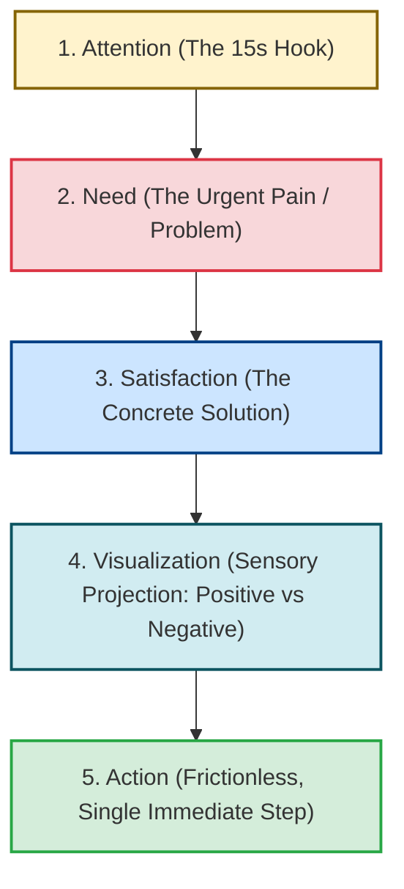

# Monroe's Motivated Sequence Methodology Specification: Persuasion & Call to Action
**The-Plan-Software Communication Engine: Cognitive Architecture & Jev Wire Catalog**

---

## 1. Executive Summary & Why Monroe's Sequence Exists

In high-stakes business pitches, sales demos, and engineering proposals, speakers frequently make a fatal persuasive mistake: **asking for the commitment before establishing the psychological need**. When an audience is presented with a solution before they feel the urgency of the problem, they experience cognitive resistance and dismiss the proposal as unnecessary or expensive.

**Monroe's Motivated Sequence** was formulated by Alan H. Monroe at Purdue University in 1935. Tested across decades of social psychology, rhetoric, and direct-response marketing, it is considered the most reliable, time-tested persuasion algorithm in human communication. Documented in Nasir's *The Plan* (Sections 2.2.10 & 3.4.10), Monroe's Sequence organizes persuasive speech into a five-step psychological progression that leads the listener naturally and irresistibly from initial curiosity to decisive, frictionless action.



### Framework Comparison: Sparkline vs. Monroe's Motivated Sequence
| Dimension | Duarte's Sparkline | Monroe's Motivated Sequence |
| :--- | :--- | :--- |
| **Primary Objective** | Narrative transformation, inspiring identity change. | **Direct persuasion, closing a deal, driving immediate action.** |
| **Core Mechanism** | Continuous oscillation between "What Is" and "What Could Be". | Step-by-step linear psychological escalation (1 $\rightarrow$ 2 $\rightarrow$ 3 $\rightarrow$ 4 $\rightarrow$ 5). |
| **Pacing Climax** | The "New Bliss" (the elevated future world). | **The "Action" Step (a specific, low-friction ask right now).** |
| **Best Used For** | Conference Keynotes, All-Hands Speeches, Visionary Talks. | **Sales Demos, Budget Approval, Investor Closes, Product Launches.** |

---

## 2. The Five Steps of Monroe's Motivated Sequence

### Step 1: Attention (Grab the Room in the First 15 Seconds)
* **Objective:** Shatter audience complacency.
* **Technique:** A shocking statistic, a provocative question, a vivid human case study, or a dramatic demonstration.
* *Example:* *"Last month, three Nigerian fintechs lost an estimated ₦180M because of a single 45-minute cloud database freeze."*

### Step 2: Need (Establish Acute Friction & Urgency)
* **Objective:** Make the listener feel that the status quo is intolerable.
* **Technique:** Show that the problem directly threatens their revenue, time, stability, or competitive edge. Present concrete evidence and consequences of inaction.
* *Example:* *"Our current legacy architecture cannot handle Black Friday traffic. If we don't refactor our cache layer before November 1st, our checkout failure rate will spike to 35%."*

### Step 3: Satisfaction (Present the Concrete Solution)
* **Objective:** Fulfill the need and satisfy objections.
* **Technique:** Clearly introduce the solution, explain how it works step-by-step, and demonstrate why it directly solves the Need without creating new bottlenecks.
* *Example:* *"We have designed a dual-write Redis cluster proxy. It intercepts all read/write spikes, absorbs 90% of database pressure, and requires zero modifications to our client SDKs."*

### Step 4: Visualization (Sensory Projection: The Two Futures)
* **Objective:** Intensify emotional desire by painting contrasting pictures of the future:
  * **Positive Visualization:** Paint the vivid picture of success, relief, and victory if the solution is implemented.
  * **Negative Visualization:** Remind them of the anxiety, chaos, and financial penalty if they do nothing.
* *Example:* *"Imagine Black Friday with zero Sev-1 alerts, sub-100ms checkout times, and our engineering team enjoying the weekend in peace. Contrast that with last year: 14 hours in an emergency war room, angry executive Slack pings, and thousands of lost transactions."*

### Step 5: Action (The Frictionless Immediate Next Step)
* **Objective:** Convert emotional momentum into immediate physical commitment.
* **The Golden Rule of Action:** The ask must be **singular, specific, and frictionless**. Never give an audience a list of 5 complicated chores. Tell them exactly what to do *today*.
* *Example:* *"I need one approval today: authorize the ₦2M staging environment budget so our team can deploy the proxy for load testing tomorrow morning."*

---

## 3. Generative Scenario Engine for Monroe's Sequence (Gemini API)

Monroe scenarios simulate high-stakes persuasive moments: selling software to an enterprise buyer, convincing a CTO to allocate budget, or rallying a team to adopt a critical engineering shift.

### 3.1 System Instruction for Gemini
```text
You are the Scenario Architect for an executive communication training platform.
Your task is to generate realistic, high-stakes persuasion scenarios specifically designed to test Monroe's Motivated Sequence.

Target Framework: MONROE_SEQUENCE
User Domain: {user_domain}
Difficulty: {difficulty_level}
Focus Theme: {focus_theme}

Output a strictly typed JSON object:
{
  "scenario_id": "unique_kebab_slug",
  "title": "Short 3-5 word title",
  "context_background": "2-3 sentences establishing a skeptical audience, an urgent business or engineering problem, and a decision requiring immediate approval.",
  "prompt_question": "A challenge instructing the user: 'Deliver a 2-minute persuasive pitch to this audience using Monroe's Motivated Sequence.'",
  "key_success_factors": [
    "Compelling Attention hook and acute Need development",
    "Concrete Satisfaction and sensory Visualization (positive and negative)",
    "Frictionless, single Call to Action"
  ],
  "target_duration_seconds": 120
}

Rules:
1. Scenarios must involve real budget, adoption, or policy decisions (e.g., enterprise software pilot, re-architecting infrastructure, adopting automated testing, securing funding).
2. The user speaks directly to the decision-maker.
```

### 3.2 Sample Monroe Scenarios
* **Scenario A (Lead Architect to CTO - Observability Platform Budget):**
  * *Context:* "Your engineering organization currently spends 20 hours per week troubleshooting production microservice errors across fragmented logs. You need the CTO to approve a $30k enterprise contract for an automated distributed tracing tool."
  * *Prompt:* *"Step into your CTO's office. You have 2 minutes on their calendar. Use Monroe's Motivated Sequence to persuade them to sign off on the pilot contract today."*
* **Scenario B (Product Founder - B2B Pilot Sale):**
  * *Context:* "You are presenting AWUN's automated merchant settlement software to the Head of Retail at a major commercial bank."
  * *Prompt:* *"Deliver your closing pitch using Monroe's 5 steps, guiding the executive from the acute pain of merchant churn to signing an immediate pilot agreement."*

---

## 4. Jev System One Wire Catalog: Comprehensive Monroe Suite

Below is the complete, criteria-rich specification for evaluating a user's Monroe Motivated Sequence response using TypeSafe AI's Jev model.

### 4.1 State Structure
```json
{
  "scenario_prompt": "Step into your CTO's office and deliver a 2-minute persuasive pitch to sign off on the distributed tracing pilot today using Monroe's Motivated Sequence.",
  "scenario_context": "Staff Engineer pitching CTO; 20 engineering hours wasted weekly debugging microservices; $30k enterprise pilot approval needed today.",
  "target_framework": "MONROE_SEQUENCE",
  "speaker_role": "Staff Backend Architect",
  "transcript": "Last month, our senior engineers spent 86 hours trapped in incident war rooms chasing silent microservice failures [Attention]. Today, when a payment times out, our team has to manually grep through 14 disparate server logs while customers abandon their carts [Need]. We have tested a 14-day trial of DataTrace: it maps distributed traces in real-time and pinpoints failing database queries in under 5 seconds [Satisfaction]. Picture our next on-call rotation: instead of 3 AM panics, engineers receive an automated slack alert with the exact failing line of code [Positive Visualization]. If we stay on our current path, our Black Friday scale will blind us to outages and cost millions [Negative Visualization]. All I need from you today is your signature on this 30-day sandbox pilot agreement so we can deploy it across staging this afternoon [Action].",
  "word_count": 146,
  "duration_seconds": 62,
  "words_per_minute": 141
}
```

---

### 4.2 The Six Core Monroe Questions Submitted to Jev

> **Cross-cutting clarity:** in addition to the framework questions below, every catalog includes the two shared
> clarity/ambiguity questions (`clarity_of_response`, `ambiguity_presence`), graded as a standalone metric that does
> not affect the composite score. See [clarity.md](./clarity.md).

#### Question 1: `monroe_attention_hook` (Primitive: `score`)
```json
{
  "type": "score",
  "instructions": "Evaluate the Attention step in `transcript` (the opening 15–20 seconds). Does the speaker grab the audience's attention immediately with a startling statistic, dramatic proof point, provocative question, or compelling vignette, or do they waste time with throat-clearing pleasantries ('Hello, thank you for meeting with me...')?",
  "criteria": {
    "Level 1": "Zero Hook / Bureaucratic Pleasantries: Opens with boring administrative throat-clearing ('Good afternoon, thanks for taking the time, today I want to discuss a proposal...'). Zero urgency or intrigue.",
    "Level 2": "Weak Statement: Opens with a mild, generic statement of fact that fails to command attention or curiosity.",
    "Level 3": "Solid Topic Hook: Clearly states an important operational topic or problem, capturing reasonable attention.",
    "Level 4": "Compelling Hook: Opens with an arresting metric, urgent incident, or provocative challenge that commands full attention.",
    "Level 5": "Masterful Attention Hook: Electrifying opening. Completely captivates the listener in the first sentence with an unforgettable statistic, visceral story, or shocking revelation."
  }
}
```

#### Question 2: `monroe_need_urgency` (Primitive: `choice`)
```json
{
  "type": "choice",
  "instructions": "Evaluate the Need step in `transcript`. In Monroe's doctrine, the speaker must prove that an acute, personal problem exists that directly impacts the listener's business, team, or revenue. Check whether the operational stakes and consequences of inaction are clearly articulated.",
  "criteria": {
    "acute_need_proven": "The speaker clearly establishes an urgent, costly problem. Proves that the status quo is causing financial waste, operational delay, or system risk that demands immediate remediation.",
    "vague_need_low_urgency": "Mentions a problem, but does so casually without establishing urgency, stakes, or why it matters today.",
    "absent": "Skips developing the need entirely; jumps straight from the hook to pitching the solution before the listener feels the pain."
  }
}
```

#### Question 3: `monroe_satisfaction_viability` (Primitive: `choice`)
```json
{
  "type": "choice",
  "instructions": "Evaluate the Satisfaction step in `transcript`. The speaker must present a concrete, viable solution that directly satisfies the Need established in Step 2. Does the speaker clearly explain what the solution is, how it works, and why it successfully solves the obstacle?",
  "criteria": {
    "concrete_viable_solution": "The solution is clearly named, technically sound, and explicitly addresses every dimension of the problem identified in the Need step.",
    "vague_or_incomplete_solution": "Presents a vague or generic idea ('we should use better software') without explaining how it works or why it solves the specific bottleneck.",
    "absent": "No solution presented."
  }
}
```

#### Question 4: `monroe_visualization_polarity` (Primitive: `score`)
```json
{
  "type": "score",
  "instructions": "Assess the Visualization step in `transcript`. Under Monroe's framework, the speaker must project the audience into sensory futures: Positive Visualization (the relief, growth, and victory of adopting the solution) AND/OR Negative Visualization (the peril, waste, and disaster of inaction). Evaluate how vividly the speaker paints these contrasting realities.",
  "criteria": {
    "Level 1": "Zero Visualization: Completely omitted. The speaker transitions mechanically from solution to ask without projecting any future outcomes.",
    "Level 2": "Weak Abstract Mention: Briefly notes that 'things would be better' without descriptive detail or emotional resonance.",
    "Level 3": "Single-Sided Visualization: Paints a clear picture of either the positive future OR the negative consequence, but misses the dynamic contrast between both.",
    "Level 4": "Strong Dual-Polarity Contrast: Vividly paints both the positive transformation (relief, speed, success) and the painful negative reality of doing nothing.",
    "Level 5": "Masterful Sensory Immersion: Electrifying visualization. The listener viscerally feels the relief of success and the acute danger of inaction, creating irresistible emotional momentum toward the ask."
  }
}
```

#### Question 5: `monroe_action_friction_and_clarity` (Primitive: `choice`)
```json
{
  "type": "choice",
  "instructions": "Evaluate the final Action step in `transcript`. In Monroe's Motivated Sequence, the closing call to action must be SINGULAR, SPECIFIC, and FRICTIONLESS. It tells the listener exactly what physical move to make *today*. Strictly penalize asking for vague or burdensome laundry lists of tasks.",
  "criteria": {
    "singular_frictionless_ask": "The call to action is razor-sharp, immediate, and low-friction (e.g., 'Authorize this 30-day staging pilot today', 'Sign here to approve the sandbox environment'). Unmistakable clarity.",
    "burdensome_or_multiple_asks": "The speaker overwhelms the listener with a laundry list of complex, high-effort requests that create decision fatigue.",
    "vague_non_committal_close": "The speaker ends without a concrete ask ('So think about it and let me know', 'We can talk again sometime'). Wastes all built-up momentum.",
    "absent": "Zero call to action provided."
  }
}
```

#### Question 6: `monroe_sequence_progression` (Primitive: `choice`)
```json
{
  "type": "choice",
  "instructions": "Evaluate the overall structural integrity of `transcript` against Monroe's 5-step sequence: Attention $\rightarrow$ Need $\rightarrow$ Satisfaction $\rightarrow$ Visualization $\rightarrow$ Action.",
  "criteria": {
    "flawless_five_step_progression": "The response flows seamlessly through all five sequential psychological stages with high natural momentum.",
    "minor_step_omission": "Follows the general structure but slightly rushes or skips one step (e.g., weak visualization).",
    "disordered_or_jumbled": "Jumbles the sequence (e.g., asking for action before explaining the problem; presenting solutions before establishing need)."
  }
}
```

---

## 5. Deterministic Scoring & Real-Time Coaching Engine (Monroe)

In Monroe's Motivated Sequence, **Need Urgency** ($25\%$), **Action Clarity** ($25\%$), and **Visualization** ($20\%$) govern the composite score.

### 5.1 Monroe Composite Score Formulation

$$Score_{\text{Monroe}} = (W_H \times S_H) + (W_N \times P_N) + (W_S \times P_S) + (W_V \times S_V) + (W_A \times P_A) + (W_P \times P_P)$$

* **Attention Hook ($W_H = 15\%$):** Normalized Score $\frac{\text{Level}}{5.0}$.
* **Need Urgency ($W_N = 25\%$):** `acute_need_proven` = $1.0$, `vague_need_low_urgency` = $0.4$, `absent` = $0.0$.
* **Satisfaction Solution ($W_S = 15\%$):** `concrete_viable_solution` = $1.0$, `vague_or_incomplete_solution` = $0.4$, `absent` = $0.0$.
* **Visualization Polarity ($W_V = 20\%$):** Normalized Score $\frac{\text{Level}}{5.0}$.
* **Action Clarity & Friction ($W_A = 25\%$ — Crucial Persuasive Pivot!):** `singular_frictionless_ask` = $1.0$, `burdensome_or_multiple_asks` = $0.4$, `vague_non_committal_close` = $0.2$, `absent` = $0.0$.
* **Sequence Progression ($W_P = 10\%$):** `flawless_five_step_progression` = $1.0$, `minor_step_omission` = $0.6$, `disordered_or_jumbled` = $0.2$.

---

### 5.2 Real-Time Coaching Triggers (Monroe Specific)

| Jev Evaluation Trigger | UI Badge | Deterministic Coaching Advice |
| :--- | :--- | :--- |
| `monroe_action_friction_and_clarity.choice == "singular_frictionless_ask"` AND `monroe_need_urgency.choice == "acute_need_proven"` | 🎯 **Persuasion Master** | *"Flawless execution of Monroe's Sequence. You established acute urgency, proved the solution, and closed with a razor-sharp, frictionless call to action."* |
| `monroe_action_friction_and_clarity.choice == "vague_non_committal_close"` | ⚠️ **The Wasted Close** | *"You built great momentum but ended with a weak, non-committal ask ('Think about it and let me know'). Always close with a specific physical step: 'Sign here for the 30-day pilot today'."* |
| `monroe_need_urgency.choice == "absent"` | 🚨 **Solution Without Need** | *"You pitched your solution before the audience felt the pain. People do not buy cures for diseases they don't have. Develop the Need and consequence of inaction first."* |
| `monroe_visualization_polarity.choice <= "Level 2"` | 🌫️ **Missing Visualization** | *"You omitted the Visualization step. People buy on emotion and justify with logic: paint a vivid picture of the relief of success versus the disaster of doing nothing."* |
| `monroe_action_friction_and_clarity.choice == "burdensome_or_multiple_asks"` | 🛑 **Decision Fatigue Warning** | *"You overwhelmed the decision-maker with too many requests. Narrow your ask to a single, frictionless next step."* |
| `monroe_attention_hook.choice <= "Level 2"` | 🥱 **Weak Opening Hook** | *"Your opening lacked punch. Cut pleasantries: open with an arresting metric or incident that shatters complacency in the first 15 seconds."* |
