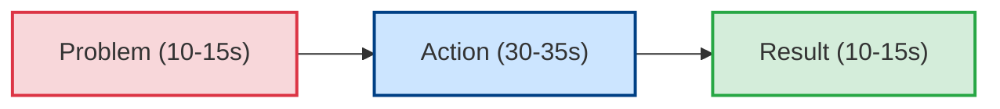

# PAR Methodology Specification: Executive Brevity & High-Impact Delivery
**The-Plan-Software Communication Engine: Cognitive Architecture & Jev Wire Catalog**

---

## 1. Executive Summary & Why PAR Exists

While **STAR** is the comprehensive standard for in-depth behavioral interviews and **CARL** evaluates senior metacognition and learning, many high-stakes situations demand **extreme brevity, high information density, and decisive clarity**.

The **PAR Framework** (**Problem, Action, Result**) strips away preamble, backstory, and narrative drift. It is designed for:
* **Initial Recruiter & Screening Phone Rounds** (where candidates have 45–60 seconds per answer).
* **Executive & C-Suite Briefings** (where leaders demand rapid bottom-line summaries).
* **Rapid-Fire Technical Panels** (answering 6–8 behavioral questions in a 30-minute block).
* **Elevator Pitches & Networking Introductions**.



### Framework Comparison: STAR vs. CARL vs. PAR
| Dimension | STAR | CARL | PAR |
| :--- | :--- | :--- | :--- |
| **Pacing Budget** | 90–120 seconds | 100–130 seconds | **45–60 seconds (Total)** |
| **Context Overhead** | ~30% (Situation + Task) | ~20% (Context) | **< 20% (Direct Problem Statement)** |
| **Core Value** | Methodical execution. | Metacognitive growth & learning. | **Executive brevity & signal-to-noise ratio.** |
| **Primary Audience** | Hiring Managers & Team Leads. | Staff+ Reviewers, Directors, VPs. | **Recruiters, Executives, Founders.** |

---

## 2. Core Evaluation Principles & Realistic Nuances

### Principle 1: Zero Backstory Drift (The 15-Second Problem Rule)
* In PAR, the speaker does not spend time describing company origins, team hierarchies, or personal feelings.
* The Problem must be articulated in **1–2 punchy opening sentences** (10–15 seconds maximum) identifying the friction point and stakes.
* *Anti-Pattern (The Creeping Backstory):* Spending 35 seconds explaining how the company was founded in 2021 before mentioning the bug.

### Principle 2: Decisive First-Person Execution ("I", Not "We")
* Because PAR answers are short, every word counts. Using passive team language ("We were having a meeting and we decided...") wastes precious seconds.
* The Action phase must immediately spotlight the candidate's personal initiative and technical choices: *"I isolated the bottleneck, re-indexed the primary key, and staged a zero-downtime hotfix."*

### Principle 3: Impact is Mandatory (Both Quantitative & Operational Count)
* In keeping with our core philosophy, results do **not** need to be solely numeric statistics to receive top scores.
* **Valid Quantitative Results:** *"This cut checkout drop-off by 28% and saved ₦8M in lost weekend orders."*
* **Valid Qualitative/Operational Results:** *"This unblocked our mobile engineering release, prevented a contract dispute with our banking partner, and restored service before customer support queues were flooded."*
* **What is Penalized:** Ending without a punchline (*"and then we moved on to the next ticket"*).

### Principle 4: High Information Density (Signal-to-Noise)
* The candidate's delivery should maintain an energetic, concise cadence ($140 - 165 \text{ WPM}$) with minimal verbal hesitation ("um", "uh", "you know").

---

## 3. Generative Scenario Engine for PAR (Gemini API)

PAR scenarios demand rapid, high-impact problem solving under tight timelines.

### 3.1 System Instruction for Gemini
```text
You are the Scenario Architect for an executive communication training platform.
Your task is to generate concise, high-intensity scenarios specifically designed to test the PAR (Problem, Action, Result) framework.

Target Framework: PAR
User Domain: {user_domain}
Difficulty: {difficulty_level}
Focus Theme: {focus_theme}

Output a strictly typed JSON object:
{
  "scenario_id": "unique_kebab_slug",
  "title": "Short 3-5 word title",
  "context_background": "1-2 sentences setting up an urgent operational, technical, or client obstacle.",
  "prompt_question": "A direct, punchy interview or executive question.",
  "target_duration_seconds": 60,
  "key_success_factors": [
    "Rapid problem statement within 15 seconds",
    "Decisive individual ownership of the solution",
    "Clear bottom-line resolution (metrics or operational impact)"
  ]
}

Rules:
1. Prompts must invite fast, decisive stories (e.g., triage, rapid bug resolution, emergency deadline, quick negotiation).
2. The target response time is strictly 45 to 60 seconds.
```

### 3.2 Sample PAR Scenarios
* **Scenario A (Senior Backend Engineer - Live Triage):**
  * *Context:* "During a high-profile live product demo to investors, your API gateway suddenly threw 504 gateway timeouts."
  * *Prompt:* *"Tell me about a time you had to diagnose and resolve a severe technical fire under intense pressure with zero time to spare."*
* **Scenario B (Engineering Lead - Cross-Team Roadblock):**
  * *Context:* "A critical compliance API scheduled for release tomorrow was blocked because two squads disagreed on data serialization formats."
  * *Prompt:* *"Give me an example of a time you rapidly stepped in to break a cross-functional deadlock and deliver on a tight deadline."*

---

## 4. Jev System One Wire Catalog: Comprehensive PAR Suite

Below is the complete, criteria-rich specification for evaluating a user's PAR response using TypeSafe AI's Jev model.

### 4.1 State Structure
```json
{
  "scenario_prompt": "Tell me about a time you had to diagnose and resolve a severe technical fire under intense pressure with zero time to spare.",
  "scenario_context": "Senior Backend Engineer; live API gateway 504 timeouts during executive demo.",
  "target_framework": "PAR",
  "speaker_role": "Senior Backend Engineer",
  "transcript": "Our authentication cluster locked up 10 minutes before our Series A pitch due to connection pool exhaustion. I immediately spun up three read replicas...",
  "word_count": 142,
  "duration_seconds": 54,
  "words_per_minute": 157
}
```

---

### 4.2 The Five Core PAR Questions Submitted to Jev

> **Cross-cutting clarity:** in addition to the framework questions below, every catalog includes the two shared
> clarity/ambiguity questions (`clarity_of_response`, `ambiguity_presence`), graded as a standalone metric that does
> not affect the composite score. See [clarity.md](./clarity.md).

#### Question 1: `par_problem_sharpness` (Primitive: `choice`)
```json
{
  "type": "choice",
  "instructions": "Evaluate whether the candidate in `transcript` establishes a sharp, immediate, and concrete Problem in response to `scenario_prompt`. In the PAR framework, the Problem must be stated rapidly within the opening 15 seconds, clearly identifying the friction point, obstacle, or failure without getting bogged down in corporate history, system lore, or unnecessary backstory. Distinguish between an immediate, high-urgency problem statement and a slow, meandering setup.",
  "criteria": {
    "sharp_and_immediate": "The candidate articulates the core problem within the opening 1–2 sentences. Identifies what broke, the operational risk, or the acute conflict crisply (e.g., 'Our core payment webhook was dropping 30% of payloads due to an unindexed database query during flash sales'). Zero unnecessary backstory.",
    "slow_meandering_setup": "The candidate eventually identifies a valid problem, but wastes 20+ seconds on company history, team structures, or general context before reaching the friction point. Delays the core point of the story.",
    "vague_or_unclear": "The problem is described in fuzzy, ambiguous terms without isolating what actually failed or what made the situation challenging (e.g., 'We were having some issues with a service and things weren't working great').",
    "absent": "No clear problem or obstacle is stated; the speaker jumps straight into tasks or talks about everyday routine work.",
    "unable_to_assess": "Transcript is garbled, corrupt, or cut off."
  }
}
```

#### Question 2: `par_action_decisiveness` (Primitive: `score`)
```json
{
  "type": "score",
  "instructions": "Assess the candidate's personal agency, decisive execution, and technical clarity in the Action component of `transcript`. In the PAR framework, brevity is paramount: evaluate whether the candidate uses direct first-person verbs ('I analyzed', 'I deployed', 'I isolated', 'I negotiated') to detail what THEY personally executed. Penalize hiding behind passive collective language ('we looked into it and we fixed it'). Look for speed of thought, decisive action, and concrete technical or operational moves.",
  "criteria": {
    "Level 1": "Passive / Zero Agency: Uses collective 'we' exclusively. Impossible to tell what the candidate personally contributed versus what teammates did. Descriptions are vague and lack technical or operational specifics.",
    "Level 2": "Hesitant / Low Ownership: Action is slow, generic, or heavily reliant on others ('I waited for the team to approve', 'I attended the call'). Shows little personal decisiveness or technical depth.",
    "Level 3": "Clear Execution: The candidate clearly articulates their personal contribution and the specific actions taken to resolve the problem. Solid and competent, though lacking deep explanation of tactical choices under pressure.",
    "Level 4": "Decisive Technical Ownership: Outstanding directness and agency. Uses crisp first-person active verbs ('I profiled the query', 'I throttled incoming traffic', 'I authored the patch'). Demonstrates high-speed diagnostic skill and proactive leadership under constraints.",
    "Level 5": "Masterful Executive Agility: Exemplary composure and decisive execution. The candidate articulates rapid triage, smart risk management, hands-on execution, and crisp stakeholder alignment under high stakes and time pressure."
  }
}
```

#### Question 3: `par_result_and_impact` (Primitive: `choice`)
```json
{
  "type": "choice",
  "instructions": "Assess the Result and Impact component in `transcript`. Evaluate whether the response delivers a punchy, unambiguous resolution. Crucially: DO NOT penalize the candidate if the result is qualitative rather than numeric. Both quantitative metrics (e.g., 'restored throughput to 12k RPS in 8 minutes', 'prevented ₦5M in chargebacks') AND meaningful qualitative/operational outcomes (e.g., 'unblocked the investor demo without a hitch', 'prevented a customer SLA breach', 'restored service before alerts escalated to executives') represent top-tier impact. Distinguish between real, tangible resolution versus weak, trailing-off non-results.",
  "criteria": {
    "quantified_metric_impact": "Result concludes with concrete numerical metrics or measurable data points (e.g., 'dropped error rate from 24% to 0% in 12 minutes', 'saved ₦10M in transaction volume', 'zero data loss across 50,000 users').",
    "meaningful_qualitative_impact": "Result delivers clear operational, strategic, technical, or relational impact without numbers (e.g., 'unblocked our product launch for the App Store deadline', 'prevented churn by retaining an enterprise partner', 'eliminated the production deadlock and restored customer checkout immediately'). A real, observable outcome.",
    "weak_or_vague_outcome": "An outcome is mentioned, but it is superficial, unsubstantiated, or trivial (e.g., 'in the end it was fine', 'everything worked out', 'people seemed relieved').",
    "absent_or_trailing_off": "No outcome provided. The narrative trails off after actions, leaving the resolution unstated or unresolved.",
    "unable_to_assess": "Transcript is garbled or incomplete."
  }
}
```

#### Question 4: `par_brevity_and_information_density` (Primitive: `choice`)
```json
{
  "type": "choice",
  "instructions": "Evaluate the information density, brevity, and pacing of `transcript` against the PAR standard (ideal duration: 45 to 65 seconds; target: high signal-to-noise ratio). Check whether the speaker delivered an efficient, punchy answer that respects the listener's time, or whether they drifted into rambling, excessive technical weeds, or repetitiveness.",
  "criteria": {
    "crisp_executive_brevity": "Exemplary brevity and density. The answer is punchy, high-signal, and delivered within 45–65 seconds. Zero wasted words; every sentence delivers critical context, decisive action, or tangible result.",
    "acceptable_pacing": "Delivered within 65–80 seconds. Well-structured and clear, though could have trimmed 1–2 minor descriptive details.",
    "bloated_or_rambling": "Exceeds 85 seconds or contains significant fluff, repetitive phrasing, or deep tangents that destroy the rapid-fire brevity required by PAR.",
    "too_brief_incomplete": "Under 25 seconds; so brief that critical technical actions or problem context are omitted entirely."
  }
}
```

#### Question 5: `par_prompt_relevance` (Primitive: `choice`)
```json
{
  "type": "choice",
  "instructions": "Determine whether the candidate's answer in `transcript` directly answers the exact scenario or pressure point posed in `scenario_prompt`.",
  "criteria": {
    "directly_relevant": "Directly tackles the specific challenge, technical fire, or conflict requested in `scenario_prompt`.",
    "partially_relevant": "Touches on the general topic, but avoids the core high-pressure or time-sensitive dilemma posed in `scenario_prompt`.",
    "tangential_or_deflected": "Answers an unrelated question or pivots to a pre-memorized story that ignores the prompt."
  }
}
```

---

## 5. Deterministic Scoring & Real-Time Coaching Engine (PAR)

In PAR, **Action Decisiveness** and **Brevity/Density** are given elevated priority.

### 5.1 PAR Composite Score Formulation

$$Score_{\text{PAR}} = (W_P \times P_P) + (W_A \times S_A) + (W_R \times P_R) + (W_B \times P_B)$$

* **Problem Sharpness ($W_P = 20\%$):**
  * `sharp_and_immediate` = $1.0$
  * `slow_meandering_setup` = $0.5$
  * `vague_or_unclear` = $0.2$
  * `absent` = $0.0$
* **Action Decisiveness & Ownership ($W_A = 45\%$):**
  * Normalized Score: $\frac{\text{Level}}{5.0}$ (Level 5 = $1.0$, Level 4 = $0.85$, Level 3 = $0.65$, Level 2 = $0.35$, Level 1 = $0.1$)
* **Result & Impact ($W_R = 20\%$):**
  * `quantified_metric_impact` = $1.0$
  * `meaningful_qualitative_impact` = **$1.0$ (Full Credit for Real Impact)**
  * `weak_or_vague_outcome` = $0.3$
  * `absent_or_trailing_off` = $0.0$
* **Brevity & Density ($W_B = 15\%$):**
  * `crisp_executive_brevity` = $1.0$
  * `acceptable_pacing` = $0.8$
  * `bloated_or_rambling` = $0.3$
  * `too_brief_incomplete` = $0.2$

---

### 5.2 Real-Time Coaching Triggers (PAR Specific)

| Jev Evaluation Trigger | UI Badge | Deterministic Coaching Advice |
| :--- | :--- | :--- |
| `par_brevity_and_information_density.choice == "crisp_executive_brevity"` | ⚡ **Executive Brevity** | *"Outstanding information density. You delivered a complete, high-impact story in under 60 seconds with zero wasted words."* |
| `par_problem_sharpness.choice == "slow_meandering_setup"` | ⚠️ **Backstory Creep** | *"You spent over 20 seconds on setup before stating the problem. In the PAR format, state the friction point in your very first sentence: 'The challenge was X'."* |
| `par_action_decisiveness.choice <= "Level 2"` | ⚠️ **Low Agency ("We")** | *"You leaned heavily on 'we'. In rapid-fire screening rounds, recruiters score personal ownership. Use active verbs: 'I investigated', 'I patched', 'I coordinated'."* |
| `par_result_and_impact.choice == "meaningful_qualitative_impact"` | ✅ **High Operational Impact** | *"Great delivery of operational impact. You clearly articulated how your actions eliminated the bottleneck and restored system stability."* |
| `par_brevity_and_information_density.choice == "bloated_or_rambling"` | ⏱️ **Bloat Warning (>75s)** | *"Your response exceeded 75 seconds. In fast screening rounds, aim for 45–60 seconds by eliminating background lore and focusing strictly on the move you made."* |
