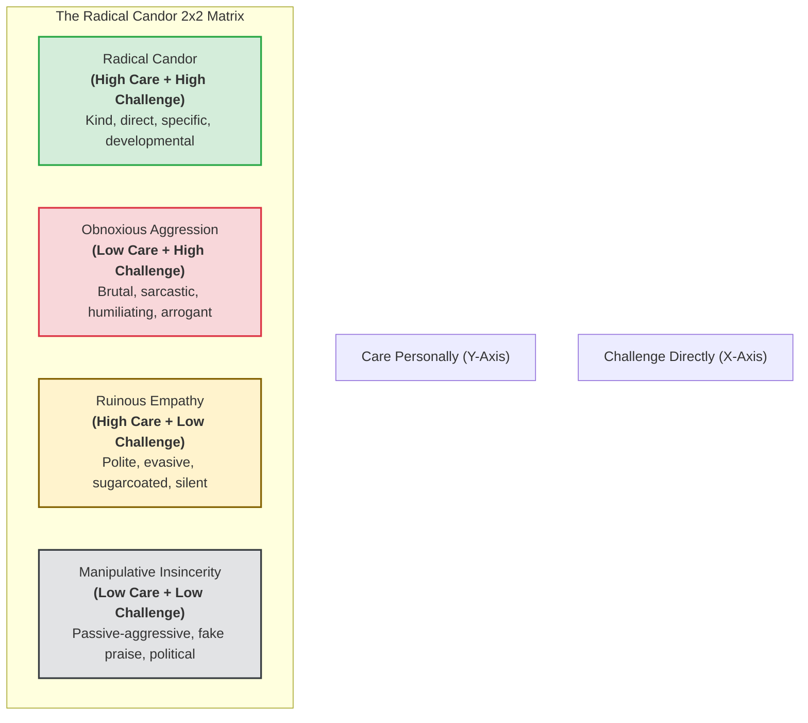

# Radical Candor Methodology Specification: Care Personally & Challenge Directly
**The-Plan-Software Communication Engine: Cognitive Architecture & Jev Wire Catalog**

---

## 1. Executive Summary & Why Radical Candor Exists

In technical organizations, performance conversations usually disintegrate into one of two toxic extremes:
1. **The Cruelty of "Brutal Honesty" (Obnoxious Aggression):** Tearing into people with sarcasm and public humiliation under the guise of "just being honest."
2. **The Cowardice of "Being Nice" (Ruinous Empathy):** Sugarcoating or withholding critical feedback out of fear of uncomfortable emotions, which lets engineers fail silently until they are abruptly PIP'd or fired.

**Radical Candor** was developed by Kim Scott (former executive at Google and Apple; faculty at Apple University) in *Radical Candor: Be a Kick-Ass Boss Without Losing Your Humanity* (2017). Cited in Nasir's *The Plan* (Sections 2.2.8 & 3.4.2), Radical Candor provides a 2×2 behavioral matrix that balances **Caring Personally** with **Challenging Directly**.



### The Four Quadrants
| Quadrant | Care Personally | Challenge Directly | Observable Behavioral Patterns | Organizational Danger |
| :--- | :---: | :---: | :--- | :--- |
| **Radical Candor** | **High** | **High** | Direct, kind, specific, private critique; addresses the work, not the person; committed to recipient's success. | **The Goal:** High trust, rapid growth, zero surprises. |
| **Obnoxious Aggression** | Low | **High** | Sarcastic, belittling, public critique; personal insults; zero empathy for the human being. | Breeds fear, turnover, and psychological unsafety. |
| **Ruinous Empathy** | **High** | Low | Vague, polite hedging; hides errors; offers hollow compliments to protect short-term feelings. | **Most Common Danger:** People fail silently without knowing why. |
| **Manipulative Insincerity** | Low | Low | Fake flattery to their face; gossip and complaining behind their back; passive-aggressive. | Toxic politics, paranoia, and cultural decay. |

---

## 2. Core Evaluation Principles & Realistic Nuances

### Principle 1: Clarity is Kindness (Challenge Directly)
* Telling an engineer that their code or architecture is ready when it is riddled with security bugs is not "kind"—it is cruel.
* Challenging directly means **unambiguous clarity**: the listener must walk away knowing *exactly* what the gap is and what standard is required.
* *What is Penalized:* Vague, hesitant hints that leave the recipient confused (*"Maybe if you have time, consider looking into that"*).

### Principle 2: Sincere Human Dignity (Care Personally)
* Caring personally is not fake corporate sentimentality or prying into personal lives. It means acknowledging the person's dignity, validating their effort, and showing that the critique comes from a genuine desire to see them succeed.
* *What is Penalized:* Treating the colleague as an expendable cog, using mockery, or enjoying the delivery of harsh news.

### Principle 3: Praise in Public, Criticize in Private
* Radical Candor mandates that corrective critique is delivered **privately and immediately**.
* Public call-outs or dressing-downs in Slack channels or group retros instantly push the interaction into **Obnoxious Aggression**.

### Principle 4: Solicit Criticism Before Giving It
* True Radical Candor begins with the leader modeling vulnerability by inviting critique on themselves:
  * *"Before we dive in, what is one thing I am doing that is making your work harder or blocking you?"*

---

## 3. Generative Scenario Engine for Radical Candor (Gemini API)

Radical Candor scenarios test the user's ability to hold high performance standards while maintaining deep respect and empathy.

### 3.1 System Instruction for Gemini
```text
You are the Scenario Architect for an executive leadership communication platform.
Your task is to generate realistic managerial and peer leadership scenarios designed specifically to test Kim Scott's Radical Candor framework.

Target Framework: RADICAL_CANDOR
User Domain: {user_domain}
Difficulty: {difficulty_level}
Focus Theme: {focus_theme}

Output a strictly typed JSON object:
{
  "scenario_id": "unique_kebab_slug",
  "title": "Short 3-5 word title",
  "context_background": "2-3 sentences detailing a high-stakes performance, quality, or behavioral issue with a valued colleague that requires urgent, direct guidance.",
  "prompt_question": "A challenge instructing the user: 'How do you address this issue directly with your colleague in a private 1-on-1 while demonstrating Radical Candor?'",
  "key_success_factors": [
    "Unflinching directness about the performance gap (High Challenge)",
    "Deep commitment to the person's dignity and career growth (High Care)",
    "Elimination of both Ruinous Empathy and Obnoxious Aggression"
  ],
  "target_duration_seconds": 90
}

Rules:
1. Scenarios must create emotional pressure to compromise: e.g., a close friend on the team who is underperforming, a brilliant technical contributor whose behavior is alienating peers, a stressed engineer who broke production.
2. The user speaks directly to the counterpart.
```

### 3.2 Sample Radical Candor Scenarios
* **Scenario A (Tech Lead to Close Friend/Colleague - Underperformance):**
  * *Context:* "An engineer you worked with for three years and consider a close friend has missed three consecutive feature deadlines, forcing teammates to pick up the slack. They seem distracted and stressed."
  * *Prompt:* *"You take them out for a private 1-on-1 coffee. How do you address their performance directly without sugarcoating it (Ruinous Empathy) or damaging the friendship (Obnoxious Aggression)?"*
* **Scenario B (VP of Engineering to Brilliant Jerk):**
  * *Context:* "Your principal backend architect is technically brilliant but belittles product managers and junior engineers during design reviews, creating an atmosphere of fear."
  * *Prompt:* *"In your private 1-on-1, address their interpersonal behavior directly, establishing that technical brilliance will not excuse toxic teamwork."*

---

## 4. Jev System One Wire Catalog: Comprehensive Radical Candor Suite

Below is the complete, criteria-rich specification for evaluating a user's Radical Candor response using TypeSafe AI's Jev model.

### 4.1 State Structure
```json
{
  "scenario_prompt": "Address your close colleague who has missed three consecutive deadlines directly without sugarcoating or damaging the relationship.",
  "scenario_context": "Tech Lead addressing long-time friend/engineer; 3 missed deadlines; team picking up slack; personal friendship creating temptation for Ruinous Empathy.",
  "target_framework": "RADICAL_CANDOR",
  "speaker_role": "Tech Lead",
  "transcript": "Marcus, I asked you to grab coffee because I care deeply about you and your trajectory here [Care Personally]. But I have to be completely candid: over the last three sprints, you missed three major API deliverables, and the team had to work weekends to cover the gap [Challenge Directly]. This is far below your capability, and if this continues, it will jeopardize your position on this team. I know things have been demanding, so I want to understand what's blocking you, and I will do whatever it takes to help you get back on track. What's going on? [Support & Dialogue]",
  "word_count": 104,
  "duration_seconds": 52,
  "words_per_minute": 120
}
```

---

### 4.2 The Five Core Radical Candor Questions Submitted to Jev

> **Cross-cutting clarity:** in addition to the framework questions below, every catalog includes the two shared
> clarity/ambiguity questions (`clarity_of_response`, `ambiguity_presence`), graded as a standalone metric that does
> not affect the composite score. See [clarity.md](./clarity.md).

#### Question 1: `candor_quadrant_classification` (Primitive: `choice`)
```json
{
  "type": "choice",
  "instructions": "Classify the overall communication in `transcript` into one of Kim Scott's four Radical Candor quadrants based on the observable balance of Care Personally (warmth, dignity, developmental investment) and Challenge Directly (unambiguous, unvarnished honesty about the problem).",
  "criteria": {
    "radical_candor": "High Care + High Challenge: The speaker speaks the unvarnished truth with clarity and courage, while simultaneously demonstrating deep respect, human dignity, and personal commitment to the recipient's growth. Direct, kind, and specific.",
    "obnoxious_aggression": "Low Care + High Challenge: The critique is direct, but delivered with sarcasm, mockery, personal insults, or public humiliation. The speaker shows zero empathy, treats the person like an object, and prioritizes being 'right' over helping.",
    "ruinous_empathy": "High Care + Low Challenge: The speaker is excessively polite, hesitant, and evasive. Sugarcoats the problem with hollow compliments and vague hints; avoids stating the hard truth to prevent uncomfortable feelings, leaving the recipient unaware of the true gravity of their failure.",
    "manipulative_insincerity": "Low Care + Low Challenge: Passive-aggressive, political, or insincere. Offers hollow flattery to their face while implying frustration, or hints at threats without transparent guidance."
  }
}
```

#### Question 2: `candor_challenge_directly_clarity` (Primitive: `score`)
```json
{
  "type": "score",
  "instructions": "Assess the 'Challenge Directly' axis of `transcript`. Evaluate whether the speaker clearly and unambiguously identifies the performance gap, behavioral failure, or standard breach. Does the listener leave the conversation knowing EXACTLY what went wrong and the stakes of failing to correct it, or did the speaker hedge and water down the critique?",
  "criteria": {
    "Level 1": "Total Evasion / No Challenge: The speaker avoids mentioning the real issue entirely, speaking in vague riddles or showering unearned praise. The recipient has no idea they are failing.",
    "Level 2": "Heavily Sugarcoated & Hedged: Mentions the issue so softly and with so many caveats that the gravity is completely lost ('Maybe if you feel like it, consider looking at things').",
    "Level 3": "Adequate Directness: Clearly names the problem and expectations, but slightly pulls punches or fails to explain the serious organizational stakes.",
    "Level 4": "Strong, Unflinching Clarity: Decisive, crystal-clear critique. Names the specific missed deliverables and the concrete stakes without hesitation or aggression.",
    "Level 5": "Masterful Directness: Flawless executive courage. Articulates the hard truth with surgical precision, establishing clear standards and non-negotiable expectations with zero ambiguity."
  }
}
```

#### Question 3: `candor_care_personally_signals` (Primitive: `score`)
```json
{
  "type": "score",
  "instructions": "Assess the 'Care Personally' axis of `transcript`. Evaluate whether the speaker demonstrates genuine human dignity, empathy, and investment in the recipient's long-term growth, rather than treating them as an obstacle or disposable resource. Look for active listening, curiosity, validation of effort, and offering concrete support.",
  "criteria": {
    "Level 1": "Cold, Callous, or Hostile: Shows active contempt, mockery, or cold indifference. Treats the recipient as an annoyance to be disposed of.",
    "Level 2": "Purely Transactional: Neutral and sterile corporate tone. No personal warmth, no inquiry into blockers, and zero empathy.",
    "Level 3": "Polite & Respectful: Treats the person with basic professional courtesy, though personal investment in their growth is limited.",
    "Level 4": "Strong Human Investment: Expresses genuine care for the person and their career. Explicitly affirms their potential and offers hands-on support or coaching.",
    "Level 5": "Exemplary Developmental Empathy: Masterful blend of personal warmth, psychological safety, and deep developmental commitment. Makes the recipient feel deeply valued as a human being while upholding the highest standards."
  }
}
```

#### Question 4: `candor_private_developmental_setting` (Primitive: `choice`)
```json
{
  "type": "choice",
  "instructions": "Evaluate whether the speaker in `transcript` establishes an appropriate private, confidential, and developmental frame for the critique ('Praise in public, criticize in private'). Check if the tone and framing are suitable for a safe 1-on-1 rather than a public dressing-down.",
  "criteria": {
    "private_developmental_frame": "The communication is framed as a private, safe, confidential 1-on-1 focused on learning and alignment.",
    "inappropriate_public_tone": "The tone implies public exposure, dressing down in front of peers, or broadcasting criticism inappropriately."
  }
}
```

#### Question 5: `candor_openness_to_counter_feedback` (Primitive: `noul`)
```json
{
  "type": "noul",
  "instructions": "Determine whether the speaker in `transcript` invites feedback on their own leadership or asks curiosity questions to uncover their own blind spots (e.g., 'What could I be doing to support you better?', 'Is there something I am doing that is blocking you?'). Under Radical Candor, great leaders solicit critique before or alongside giving it.",
  "criteria": {
    "yes": "The speaker explicitly invites reciprocal feedback or asks what they personally can do to support or remove blockers.",
    "no": "The speaker solely delivers one-directional feedback and asks zero reciprocal questions about their own leadership."
  }
}
```

---

## 5. Deterministic Scoring & Real-Time Coaching Engine (Radical Candor)

In Radical Candor, the score requires **both** High Care ($W_C = 35\%$) and High Challenge ($W_D = 45\%$). Failing either axis collapses the score.

### 5.1 Radical Candor Composite Score Formulation

$$Score_{\text{RC}} = (W_Q \times P_Q) + (W_D \times S_D) + (W_C \times S_C) + (W_F \times P_F)$$

* **Quadrant Classification ($W_Q = 30\%$):**
  * `radical_candor` = $1.0$
  * `ruinous_empathy` = $0.4$ (Dangerous failure mode)
  * `obnoxious_aggression` = $0.2$ (Destructive failure mode)
  * `manipulative_insincerity` = $0.0$ (Toxic failure mode)
* **Challenge Directly Score ($W_D = 35\%$):** Normalized $\frac{\text{Level}}{5.0}$.
* **Care Personally Score ($W_C = 25\%$):** Normalized $\frac{\text{Level}}{5.0}$.
* **Private Frame & Reciprocal Openness ($W_F = 10\%$):** Combined frame bonus.

---

### 5.2 Real-Time Coaching Triggers (Radical Candor Specific)

| Jev Evaluation Trigger | UI Badge | Deterministic Coaching Advice |
| :--- | :--- | :--- |
| `candor_quadrant_classification.choice == "radical_candor"` | 🌟 **Radical Candor Achieved** | *"Exemplary leadership. You spoke the hard, necessary truth with unmistakable clarity while demonstrating deep personal care and investment in their growth."* |
| `candor_quadrant_classification.choice == "ruinous_empathy"` | ⚠️ **The Ruinous Empathy Trap** | *"You were too soft and hedged your critique. Out of fear of hurting feelings, you failed to communicate the gravity of the problem. Remember: 'Clarity is kindness'. Be direct about the standard."* |
| `candor_quadrant_classification.choice == "obnoxious_aggression"` | 🚨 **Obnoxious Aggression Alert** | *"Your critique was harsh and dismissive. Challenging directly without personal care creates defensiveness and fear. Acknowledge their dignity and offer genuine support."* |
| `candor_challenge_directly_clarity.choice <= "Level 2"` | ⚠️ **Vague Guidance** | *"The recipient leaves this conversation without knowing exactly what must change. Be specific: name the exact deliverables, dates, and non-negotiable standards."* |
| `candor_care_personally_signals.choice <= "Level 2"` | ❄️ **Cold / Transactional Tone** | *"Your tone was sterile and transactional. Connect before you correct: affirm their value to the team and express a genuine desire to see them succeed."* |
| `candor_openness_to_counter_feedback.yes >= 0.7` | 🤝 **Reciprocal Vulnerability** | *"Great leadership practice. Inviting feedback on your own management builds deep psychological safety and trust."* |
