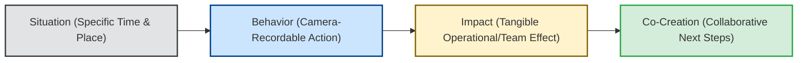

# SBI Methodology Specification: Situation-Behavior-Impact Feedback Architecture
**The-Plan-Software Communication Engine: Cognitive Architecture & Jev Wire Catalog**

---

## 1. Executive Summary & Why SBI Exists

The single greatest point of failure in leadership and peer communication is **corrective feedback**. Traditional feedback almost always triggers defensiveness, denial, and interpersonal hostility because leaders conflate **observable facts** with **subjective character judgments**.

The **SBI Framework** (**Situation, Behavior, Impact**) was developed by the Center for Creative Leadership (CCL). Grounded in cognitive appraisal theory and behavioral psychology, it is the premier evidence-based model for delivering critique without triggering psychological defensiveness (the amygdala hijack). Cited in Nasir's *The Plan* (Sections 2.2.8 & 3.4.8), SBI strips away emotional venting and mind-reading, anchoring the feedback in objective reality and operational outcomes.



### Traditional Feedback vs. SBI Feedback
| Dimension | Traditional Flawed Feedback | SBI Evidence-Based Feedback |
| :--- | :--- | :--- |
| **Opening** | *"You have a bad attitude in meetings."* | *"Yesterday during the 10:00 AM sprint retro [Situation]..."* |
| **Observation** | *"You are arrogant, disrespectful, and don't care about the team."* | *"...you interrupted the junior engineer three times while she was presenting [Behavior]..."* |
| **Impact** | *"People are annoyed with you."* | *"...as a result, she stopped sharing her architectural findings, and the team lost 20 minutes of root-cause analysis [Impact]."* |
| **Conclusion** | *"Fix this immediately."* (Dictate) | *"What was happening from your perspective? How can we handle this better next time? [Co-Creation]"* |

---

## 2. Core Evaluation Principles & Realistic Nuances

### Principle 1: The "Camera-Recordable" Test (Zero Mind-Reading)
* **The Golden Rule of SBI:** A valid **Behavior** is strictly something a video camera could capture or an audio recorder could transcribe.
* **Camera-Recordable:** Words spoken, specific interruptions, missed pull requests, arriving 15 minutes late, typing on a phone during a presentation.
* **NOT Camera-Recordable (Subjective Judgments):** *"You were lazy", "You were dismissive", "You had an attitude", "You don't respect authority", "You lacked commitment"*. These are mind-reading assumptions that guarantee defensive pushback.

### Principle 2: Precise Situational Anchoring (Banish "Always" and "Never")
* Feedback must be anchored to a **specific time, meeting, or event** (*"During yesterday's incident war room..."*).
* Sweeping generalizations (*"You always interrupt people", "You never update Jira"*) trigger immediate fact-checking arguments (*"I didn't interrupt last Tuesday!"*), completely distracting from the core issue.

### Principle 3: Impact Accountability (Both Relational & Operational)
* The **Impact** explains why the behavior matters. It must articulate the consequence on the team, the system, or the business.
* **Valid Operational Impact:** *"As a result, our staging deployment was blocked for 3 hours and the QA team had to work overtime."*
* **Valid Relational/Team Impact:** *"As a result, junior engineers felt hesitant to raise safety concerns, damaging our psychological safety."*

### Principle 4: Banish the "Feedback Sandwich"
* The amateur practice of sandwiching criticism between fake compliments (*"You're a great guy, BUT your code quality is awful, BUT you have great energy"*) dilutes the message and breeds organizational cynicism.
* SBI values **clean, respectful directness**: state the Situation, describe the Behavior, explain the Impact, and pause.

### Principle 5: Co-Authoring the Solution
* Effective feedback is not a lecture; it is an invitation to dialogue.
* The giver pauses and asks curiosity questions: *"Help me understand what was going on from your side"* or *"What can we do to ensure this doesn't recur?"*

---

## 3. Generative Scenario Engine for SBI (Gemini API)

SBI practice scenarios simulate real managerial, peer, or technical feedback situations where performance or behavioral correction is mandatory.

### 3.1 System Instruction for Gemini
```text
You are the Scenario Architect for an executive leadership and communication platform.
Your task is to generate realistic workplace feedback scenarios specifically designed to test the SBI (Situation, Behavior, Impact) framework.

Target Framework: SBI
User Domain: {user_domain}
Difficulty: {difficulty_level}
Focus Theme: {focus_theme}

Output a strictly typed JSON object:
{
  "scenario_id": "unique_kebab_slug",
  "title": "Short 3-5 word title",
  "context_background": "2-3 sentences detailing a specific incident where a peer, subordinate, or contractor exhibited problematic behavior that impacted the team.",
  "prompt_question": "A challenge instructing the user: 'How do you give feedback to this person in your upcoming 1-on-1?'",
  "key_success_factors": [
    "Strict separation of camera-recordable behavior from character judgments",
    "Concrete, observable operational or team impact",
    "Invitation to co-create the solution"
  ],
  "target_duration_seconds": 90
}

Rules:
1. Ground scenarios in relatable tech leadership dilemmas (e.g., cutting off teammates in code review, pushing unreviewed code to prod, failing to communicate a blocker, aggressive Slack messages).
2. The user must speak directly as if addressing the colleague face-to-face.
```

### 3.2 Sample SBI Scenarios
* **Scenario A (Tech Lead to Senior Engineer - Aggressive Code Reviews):**
  * *Context:* "A senior engineer on your team left multiple dismissive, mocking comments on a junior engineer's pull request ('Who wrote this garbage?', 'Did you even test this?'), causing the junior engineer to shut down and privately request a team transfer."
  * *Prompt:* *"You are meeting with the senior engineer in your weekly 1-on-1. How do you deliver corrective feedback using the SBI framework?"*
* **Scenario B (Engineering Manager to Contractor - Missed Deadlines):**
  * *Context:* "A contract backend engineer missed two consecutive sprint commitments without proactively alerting the team, blocking the mobile team from integrating authentication APIs."
  * *Prompt:* *"Call the contractor into a private meeting and deliver feedback on their communication and delivery using SBI."*

---

## 4. Jev System One Wire Catalog: Comprehensive SBI Suite

Below is the complete, criteria-rich specification for evaluating a user's SBI feedback response using TypeSafe AI's Jev model.

### 4.1 State Structure
```json
{
  "scenario_prompt": "You are meeting with a senior engineer who left dismissive comments on a junior engineer's pull request. Deliver feedback using SBI.",
  "scenario_context": "Tech Lead giving feedback to Senior Engineer; mocking PR comments ('Who wrote this garbage?'); junior engineer requested transfer.",
  "target_framework": "SBI",
  "speaker_role": "Tech Lead",
  "transcript": "Thanks for meeting with me, Alex. Yesterday afternoon on PR #412 [Situation], you left two comments saying 'Who wrote this garbage?' and 'Did you even bother testing this?' [Behavior]. When you use that language, the impact is that our junior engineers feel humiliated, they hesitate to push code, and Maya actually requested a team transfer today [Impact]. I need code reviews to be constructive. What was happening from your perspective, and how can we approach this differently next time? [Co-Creation]",
  "word_count": 92,
  "duration_seconds": 46,
  "words_per_minute": 120
}
```

---

### 4.2 The Five Core SBI Questions Submitted to Jev

> **Cross-cutting clarity:** in addition to the framework questions below, every catalog includes the two shared
> clarity/ambiguity questions (`clarity_of_response`, `ambiguity_presence`), graded as a standalone metric that does
> not affect the composite score. See [clarity.md](./clarity.md).

#### Question 1: `sbi_situation_anchoring` (Primitive: `choice`)
```json
{
  "type": "choice",
  "instructions": "Evaluate whether the speaker in `transcript` anchors their feedback in a specific, concrete Situation in response to `scenario_prompt`. Under the Center for Creative Leadership's SBI framework, valid Situations isolate an exact time, location, meeting, or documented event. Strictly penalize sweeping generalizations that lack grounding (e.g., 'You always do this', 'Lately you've been...').",
  "criteria": {
    "specifically_anchored_time_place": "The speaker anchors the feedback in an unmistakable, specific past moment (e.g., 'Yesterday during our 2:00 PM sprint retro...', 'On Thursday on PR #412...'). Grounded, clean, and impossible to mistake for a general accusation.",
    "vague_general_anchoring": "Mentions a loose context (e.g., 'In recent meetings...', 'Over the last sprint...'), but lacks the precision of a specific incident or timestamp.",
    "unanchored_sweeping_claim": "Uses sweeping, absolute generalizations without any situational anchor (e.g., 'You always act like this', 'You never communicate properly'). Triggers immediate defensive fact-checking.",
    "absent": "Zero situational context provided; dives straight into accusations or impact.",
    "unable_to_assess": "Transcript is garbled or incomplete."
  }
}
```

#### Question 2: `sbi_behavioral_camera_test` (Primitive: `score`)
```json
{
  "type": "score",
  "instructions": "Apply the 'Camera-Recordable Test' to the Behavior component of `transcript`. A valid Behavior describes ONLY observable, camera-recordable actions or verbatim words spoken. Assess whether the speaker describes objective physical facts or falls into subjective mind-reading, personality labels, or character judgments (e.g., 'you were arrogant', 'you don't care', 'you were aggressive').",
  "criteria": {
    "Level 1": "Severe Character Attack / Mind-Reading: The speaker uses purely subjective personality traits and emotional accusations ('You were rude, condescending, and unprofessional', 'You don't care about the team'). Zero camera-recordable facts.",
    "Level 2": "Predominantly Judgmental: Focuses mostly on interpretations with one or two vague actions ('You had a bad attitude and rolled your eyes'). High risk of defensive escalation.",
    "Level 3": "Adequate Objective Observation: Describes actual actions and words spoken, but occasionally mixes in interpretive adjectives ('You aggressively interrupted her twice and spoke too loud').",
    "Level 4": "Strong Camera-Recordable Specificity: Strictly adheres to observable facts and quoted statements without character attacks ('You interrupted Maya three times while she was presenting slide 4 and said...'). Clinical and indisputable.",
    "Level 5": "Masterful Behavioral Precision: Flawless adherence to CCL doctrine. Completely objective, camera-recordable description of physical actions, timestamps, and verbatim words with zero emotional charge, moralizing, or mind-reading."
  }
}
```

#### Question 3: `sbi_impact_operational_clarity` (Primitive: `choice`)
```json
{
  "type": "choice",
  "instructions": "Evaluate the Impact component in `transcript`. In the SBI framework, Impact explains the tangible consequences of the behavior on the project, team dynamics, psychological safety, or business outcomes. Distinguish between clear, meaningful impact statements versus vague emotional venting ('it made me mad').",
  "criteria": {
    "clear_operational_or_relational_impact": "Articulates tangible, observable consequences on work velocity, team morale, client trust, or psychological safety (e.g., 'As a result, she stopped presenting, we lost 20 minutes of review time, and she felt unsafe contributing').",
    "vague_emotional_venting": "Describes emotional frustration without linking it to operational or team consequences (e.g., 'It really annoyed me', 'I was very upset with you').",
    "absent_impact": "The speaker describes the behavior but never explains the consequence or why it matters, leaving the recipient wondering why it was brought up."
  }
}
```

#### Question 4: `sbi_feedback_sandwich_filter` (Primitive: `choice`)
```json
{
  "type": "choice",
  "instructions": "Screen `transcript` for the amateur 'Feedback Sandwich' technique (cushioning criticism between fake, insincere compliments). CCL and Radical Candor strictly ban the sandwich because it breeds cynicism and obscures the real developmental message.",
  "criteria": {
    "clean_direct_candor": "Direct, respectful, and transparent. States the feedback clearly without hiding behind artificial flattery or manipulative cushioning.",
    "artificial_sandwiching_detected": "The speaker wraps the critique in transparent compliments (e.g., 'You're doing fantastic work, BUT you were completely disrespectful, BUT we love having you here')."
  }
}
```

#### Question 5: `sbi_solution_co_creation` (Primitive: `choice`)
```json
{
  "type": "choice",
  "instructions": "Evaluate how the feedback concludes in `transcript`. Under modern SBI leadership practice, the giver does not issue a unilateral ultimatum or drop the issue abruptly; they invite dialogue and co-author the solution using curiosity questions ('What was happening from your perspective?', 'How can we solve this together?').",
  "criteria": {
    "collaborative_co_creation": "The speaker pauses, invites the recipient's perspective, and asks open-ended questions to co-design future behavioral safeguards (e.g., 'Help me understand what led to that', 'How can we ensure reviews stay constructive?').",
    "unilateral_dictate_or_threat": "The speaker issues an authoritarian command or threat without listening (e.g., 'Fix this immediately or you're off the team').",
    "unresolved_or_abrupt_end": "The feedback ends awkwardly after describing the impact, offering zero discussion or path forward."
  }
}
```

---

## 5. Deterministic Scoring & Real-Time Coaching Engine (SBI)

In SBI, the **Camera-Recordable Test (Behavior)** and **Impact Clarity** carry the heaviest weight.

### 5.1 SBI Composite Score Formulation

$$Score_{\text{SBI}} = (W_S \times P_S) + (W_B \times S_B) + (W_I \times P_I) + (W_F \times P_F) + (W_C \times P_C)$$

* **Situation Anchoring ($W_S = 15\%$):** `specifically_anchored_time_place` = $1.0$, `vague_general_anchoring` = $0.5$, `unanchored_sweeping_claim` = $0.1$, `absent` = $0.0$.
* **Camera-Recordable Behavior ($W_B = 35\%$ — Heaviest Weight!):** Normalized Score $\frac{\text{Level}}{5.0}$.
* **Impact Clarity ($W_I = 25\%$):** `clear_operational_or_relational_impact` = $1.0$, `vague_emotional_venting` = $0.4$, `absent_impact` = $0.0$.
* **Feedback Sandwich Filter ($W_F = 10\%$):** `clean_direct_candor` = $1.0$, `artificial_sandwiching_detected` = $0.3$.
* **Solution Co-Creation ($W_C = 15\%$):** `collaborative_co_creation` = $1.0$, `unilateral_dictate_or_threat` = $0.3$, `unresolved_or_abrupt_end` = $0.2$.

---

### 5.2 Real-Time Coaching Triggers (SBI Specific)

| Jev Evaluation Trigger | UI Badge | Deterministic Coaching Advice |
| :--- | :--- | :--- |
| `sbi_behavioral_camera_test.choice >= "Level 4"` | 📹 **Camera-Recordable Precision** | *"Flawless behavioral feedback. You stuck entirely to observable facts and quoted language, eliminating defensive friction."* |
| `sbi_behavioral_camera_test.choice <= "Level 2"` | 🚨 **Mind-Reading / Character Attack** | *"You used subjective personality labels ('you were rude / unprofessional'). That triggers instant defensiveness. Describe only what a video camera could record: exact words and specific physical actions."* |
| `sbi_situation_anchoring.choice == "unanchored_sweeping_claim"` | ⚠️ **The 'Always / Never' Trap** | *"You used sweeping absolutes ('You always do this'). This triggers fact-checking debates. Anchor your feedback to a single specific date, meeting, or pull request."* |
| `sbi_impact_operational_clarity.choice == "absent_impact"` | ⚠️ **Missing Impact** | *"You described the behavior but never explained why it matters. Articulate the operational or team consequence: did it cause delay, demoralize colleagues, or risk client trust?"* |
| `sbi_feedback_sandwich_filter.choice == "artificial_sandwiching_detected"` | 🥪 **Sandwich Detected** | *"Avoid hiding hard critique inside fake compliments. Leaders value clean, direct, and respectful transparency."* |
| `sbi_solution_co_creation.choice == "collaborative_co_creation"` | 🤝 **Co-Authored Solution** | *"Excellent transition to curiosity. Inviting their perspective transforms critique into a collaborative coaching moment."* |
