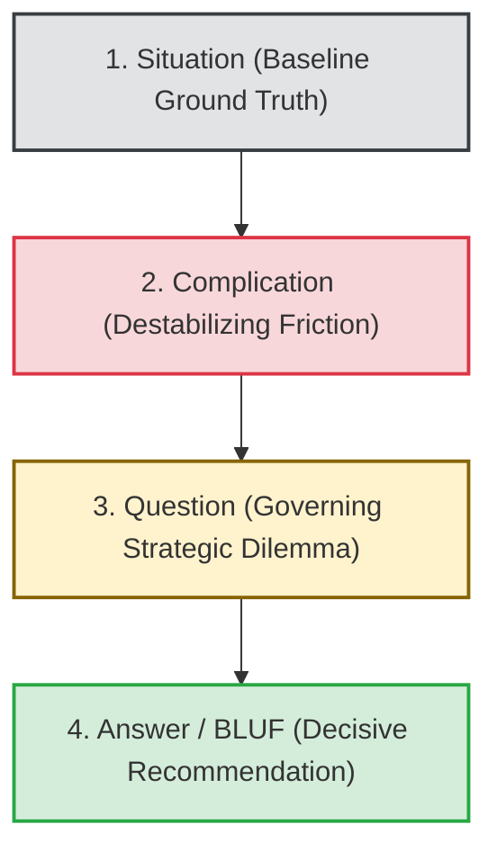

# SCQA Methodology Specification: The Minto Pyramid & Executive Structuring
**The-Plan-Software Communication Engine: Cognitive Architecture & Jev Wire Catalog**

---

## 1. Executive Summary & Why SCQA Exists

In technical and corporate leadership, the single most common communication failure is **"Burying the Lede"**—taking the audience on a winding, chronological detective journey before finally revealing the recommendation in the closing seconds.

The **SCQA Framework** (**Situation, Complication, Question, Answer**) was created by Barbara Minto at McKinsey & Company (1981) in *The Pyramid Principle*. It is the undisputed global standard for executive briefings, architecture review proposals (RFCs), investor updates, and C-suite technical memos. Cited in Nasir's *The Plan* (Sections 2.2.2 & 3.4.2), SCQA operationalizes **BLUF (Bottom Line Up Front)**: structuring ideas so the human brain can process high-stakes technical proposals with zero cognitive friction.



### Framework Comparison: Narrative (STAR) vs. Structural (SCQA)
| Dimension | STAR (Behavioral / Storytelling) | SCQA (Minto Pyramid / Strategic) |
| :--- | :--- | :--- |
| **Primary Goal** | Prove past individual competence & execution. | Persuade leadership to adopt a technical/business decision. |
| **Pacing Order** | Chronological past: S $\rightarrow$ T $\rightarrow$ A $\rightarrow$ R. | Logical hierarchy: Common Ground $\rightarrow$ Friction $\rightarrow$ Dilemma $\rightarrow$ **Recommendation**. |
| **Context Role** | Establish personal setting & scale. | Establish **uncontroversial agreement** before introducing tension. |
| **Primary Audience** | Interviewers, Promotion Panels. | Executives, VPs, CTOs, Board Members, Investors. |

---

## 2. Core Evaluation Principles & Realistic Nuances

### Principle 1: The Uncontroversial Baseline Situation
* In Minto's doctrine, the **Situation** must be something all stakeholders agree on without debate (*"As we know, our payment gateway processes ₦200M daily with 99.9% uptime"*).
* If the speaker opens with a controversial or accusatory claim (*"Our infrastructure is terrible and we're falling behind"*), stakeholders instantly enter cognitive defense mode and stop listening to the recommendation.

### Principle 2: The Acute Complication (The Catalyst)
* The **Complication** explains why the status quo can no longer hold. It introduces the catalyst: an API deprecation, a cost spike, an upcoming regulatory deadline, or a technical bottleneck.
* It must articulate **the operational stakes of inaction** (*"If unaddressed before Q4, checkout drop-off will spike by 30%"*).

### Principle 3: BLUF Efficiency (Bottom Line Up Front)
* Senior leaders have zero patience for mystery novels. The **Answer** must not be buried.
* In spoken briefings, the speaker must transition smoothly through S-C-Q and deliver a clear, actionable **Answer** with structured rationale.
* Top scores are awarded when the recommendation is stated clearly, decisively, and supported by structured logical pillars.

### Principle 4: Actionable Substance (Quantitative & Operational Value)
* The **Answer** must not be vague hand-waving (*"We should look into better tools"*).
* It must propose a concrete, actionable move—whether backed by **quantitative figures** (*"Deploying the multi-region Redis cluster cuts latency by 60% and saves ₦15M"*) or **qualitative/operational alignment** (*"Adopting an asynchronous queue decouples our billing pipeline, unblocks the mobile team, and eliminates our single point of failure"*).

---

## 3. Generative Scenario Engine for SCQA (Gemini API)

SCQA scenarios simulate high-stakes proposals where technical leaders must brief busy executives, CTOs, or investors on complex decisions.

### 3.1 System Instruction for Gemini
```text
You are the Scenario Architect for an executive communication training platform.
Your task is to generate realistic, high-stakes briefing scenarios specifically designed to test the SCQA (Situation, Complication, Question, Answer) framework.

Target Framework: SCQA
User Domain: {user_domain}
Difficulty: {difficulty_level}
Focus Theme: {focus_theme}

Output a strictly typed JSON object:
{
  "scenario_id": "unique_kebab_slug",
  "title": "Short 3-5 word title",
  "context_background": "2-3 sentences establishing the baseline operational environment, a sudden architectural or business disruption, and the decision required.",
  "prompt_question": "The opening challenge from the executive or stakeholder.",
  "key_success_factors": [
    "Uncontroversial baseline Situation",
    "Sharp Complication with operational stakes",
    "Clear, decisive Answer (BLUF) with structured pillars"
  ],
  "target_duration_seconds": 90
}

Rules:
1. Scenarios must reflect real tech leadership challenges (e.g., cloud cost overruns, legacy database limits, vendor price hikes, security migration deadlines).
2. The prompt should simulate a busy executive saying: 'Give me the quick update: what is the situation, and what do you recommend we do?'
```

### 3.2 Sample SCQA Scenarios
* **Scenario A (Staff Infrastructure Engineer - Database Deprecation):**
  * *Context:* "Your cloud vendor announced that your primary managed database engine will reach End of Life in 60 days. Upgrading requires either a risky in-place upgrade or a multi-month asynchronous migration to a new managed service."
  * *Prompt:* *"The CTO stops you in the hallway: 'I saw the alert about our database reaching EOL in two months. Give me the breakdown: where do we stand, what's at risk, and what's your recommendation?'"*
* **Scenario B (Engineering Manager - Build vs. Buy Decision):**
  * *Context:* "Customer onboarding fraud has spiked 400% over the last quarter. Building an internal fraud engine will take 4 months and 3 engineers; integrating an external API will cost ₦25M annually but launch in 2 weeks."
  * *Prompt:* *"The VP of Operations asks: 'We're losing money daily to onboarding fraud. Walk me through the options and tell me what we should do today.'"*

---

## 4. Jev System One Wire Catalog: Comprehensive SCQA Suite

Below is the complete, criteria-rich specification for evaluating a user's SCQA response using TypeSafe AI's Jev model.

### 4.1 State Structure
```json
{
  "scenario_prompt": "I saw the alert about our database reaching EOL in two months. Give me the breakdown: where do we stand, what's at risk, and what's your recommendation?",
  "scenario_context": "Staff Engineer briefing CTO; AWS RDS MySQL 5.7 EOL deadline in 60 days; 24/7 transaction traffic.",
  "target_framework": "SCQA",
  "speaker_role": "Staff Infrastructure Engineer",
  "transcript": "As you know, our core transaction ledger has been running on MySQL 5.7 processing ₦500M weekly with zero downtime [Situation]. However, AWS is terminating support on Nov 30th, meaning our cluster will lose automated security patches and incur a 300% hourly cost penalty [Complication]. The core question is whether we risk an in-place version upgrade over a weekend or migrate to Aurora Serverless [Question]. I strongly recommend we deploy to Aurora Serverless via dual-writing; it eliminates downtime risk and keeps our compliance intact [Answer]...",
  "word_count": 210,
  "duration_seconds": 82,
  "words_per_minute": 154
}
```

---

### 4.2 The Six Core SCQA Questions Submitted to Jev

> **Cross-cutting clarity:** in addition to the framework questions below, every catalog includes the two shared
> clarity/ambiguity questions (`clarity_of_response`, `ambiguity_presence`), graded as a standalone metric that does
> not affect the composite score. See [clarity.md](./clarity.md).

#### Question 1: `scqa_situation_baseline` (Primitive: `choice`)
```json
{
  "type": "choice",
  "instructions": "Evaluate whether the speaker in `transcript` opens with an uncontroversial, mutually agreed-upon baseline Situation before introducing complications or proposals, as prescribed by Barbara Minto's SCQA doctrine. The Situation must state context that all stakeholders recognize and accept as ground truth, establishing common ground without triggering immediate debate.",
  "criteria": {
    "uncontroversial_clear_baseline": "The speaker opens with a clear, recognized, and uncontroversial baseline fact or organizational reality (e.g., 'As we know, our transaction cluster processes ₦500M weekly with zero downtime...'). It establishes shared ground immediately.",
    "controversial_or_abrupt_lead": "The speaker skips the baseline context and opens immediately with alarmism, controversial claims, or attacks that trigger listener resistance before common ground is established.",
    "vague_or_delayed_situation": "The baseline situation is fuzzy, overly long, or buried under confusing technical history.",
    "absent": "Zero baseline context provided; the speaker dives directly into complaints or unanchored recommendations.",
    "unable_to_assess": "Transcript is garbled or incomplete."
  }
}
```

#### Question 2: `scqa_complication_friction` (Primitive: `choice`)
```json
{
  "type": "choice",
  "instructions": "Evaluate the clarity, urgency, and operational specificity of the Complication in `transcript`. In Minto's SCQA, the Complication represents the specific trigger, anomaly, deadline, or failure that destabilizes the baseline Situation and forces an engineering or business decision. Check if the operational stakes of inaction are clearly articulated.",
  "criteria": {
    "sharp_urgent_friction": "Explicitly pinpoints what changed or broke, why it matters, and the operational stakes of inaction (e.g., 'However, AWS is terminating support in 60 days, which will strip security patches and trigger 300% penalty pricing'). The friction is unmistakable.",
    "vague_friction_low_stakes": "Mentions a problem or friction, but does so vaguely without specifying root cause, timeline, or concrete business/technical consequences.",
    "absent": "No complication is articulated; the speaker rambles descriptively or offers a solution to a problem that was never explained."
  }
}
```

#### Question 3: `scqa_governing_question` (Primitive: `choice`)
```json
{
  "type": "choice",
  "instructions": "Determine whether the speaker clearly frames or sharply implies the governing Question in `transcript`. The Question bridges the Complication and Answer: it isolates the specific strategic or technical dilemma that leadership must decide upon (e.g., 'The question we face is whether to build an internal tool or buy an enterprise API').",
  "criteria": {
    "explicitly_articulated": "The governing dilemma or decision choice is stated explicitly as a clean question or choice framework.",
    "clearly_implied": "Not framed as a literal question mark, but the operational dilemma and competing choices are unmistakably clear from the transition.",
    "muddled_or_missing": "The speaker jumps abruptly from problem to recommendation without framing the decision choices, leaving the listener unclear on what options were evaluated."
  }
}
```

#### Question 4: `scqa_bluf_efficiency` (Primitive: `score`)
```json
{
  "type": "score",
  "instructions": "Assess Bottom Line Up Front (BLUF) efficiency: how rapidly and directly does the speaker deliver their core Answer / strategic recommendation in `transcript`? Executive communication demands early clarity; evaluate whether the listener receives the bottom-line proposal immediately or has to wade through chronological minutiae.",
  "criteria": {
    "Level 1": "Completely Buried: The speaker spends the entire briefing in the weeds, never clearly stating a recommendation, or only muttering a vague conclusion in the final seconds.",
    "Level 2": "Delayed & Hedged: Recommendation is stated late, buried under excessive caveats, hesitations, or confusing chronological trivia.",
    "Level 3": "Moderate Directness: Recommendation is clearly stated, but only after a prolonged setup. Clear once reached, but inefficient for an executive.",
    "Level 4": "Strong BLUF: Core recommendation is articulated early, supported by structured logical arguments and clear next steps.",
    "Level 5": "Masterful Executive BLUF: The governing recommendation is delivered with exceptional clarity, crisp justification, top-down structure, and immediate operational steps."
  }
}
```

#### Question 5: `scqa_recommendation_substance` (Primitive: `choice`)
```json
{
  "type": "choice",
  "instructions": "Evaluate the substance and actionability of the Answer/Recommendation in `transcript`. In executive communication, the recommendation must be decisive and actionable, supported by real impact (either quantitative or operational/strategic). Penalize non-committal hedging ('we could maybe look into a few options').",
  "criteria": {
    "actionable_high_impact_solution": "The recommendation is decisive, concrete, and supported by clear impact (e.g., names specific technologies, timelines, resource needs, and benefits). Represents an unambiguous path forward.",
    "partial_hedged_solution": "A recommendation is given, but it is heavily hedged or lacks concrete implementation details (e.g., 'We should probably upgrade soon, but we need more meetings').",
    "vague_non_committal": "Fails to provide a clear answer; merely lists problems or says 'it's complicated' without taking an executive stance."
  }
}
```

#### Question 6: `scqa_structural_flow` (Primitive: `choice`)
```json
{
  "type": "choice",
  "instructions": "Evaluate the overall structural discipline of `transcript` against the Minto Pyramid standard. Check whether the briefing moves smoothly through the logical hierarchy, or whether it devolves into rambling chronological storytelling.",
  "criteria": {
    "textbook_minto_flow": "Flawless logical progression: Uncontroversial Situation $\rightarrow$ Urgent Complication $\rightarrow$ Crisp Dilemma $\rightarrow$ Decisive Answer.",
    "inverted_bluf_flow": "Opens with the Answer/Recommendation immediately, followed by the supporting Situation and Complication. Highly acceptable in modern C-suite briefings.",
    "rambling_chronological_weeds": "Devolves into an unstructured, chronological 'story' filled with technical trivia and tangents that lose executive focus.",
    "chaotic_disorganized": "Lacks logical structure. Jumps randomly between complaints, solutions, and history."
  }
}
```

---

## 5. Deterministic Scoring & Real-Time Coaching Engine (SCQA)

In SCQA, **BLUF Efficiency** and **Complication Friction** receive top weight to ensure executive brevity and decisive recommendations.

### 5.1 SCQA Composite Score Formulation

$$Score_{\text{SCQA}} = (W_S \times P_S) + (W_C \times P_C) + (W_Q \times P_Q) + (W_{\text{BLUF}} \times S_{\text{BLUF}}) + (W_R \times P_R) + (W_F \times P_F)$$

* **Situation Grounding ($W_S = 10\%$):** `uncontroversial_clear_baseline` = $1.0$, `controversial_or_abrupt_lead` = $0.3$, `absent` = $0.0$.
* **Complication Friction ($W_C = 20\%$):** `sharp_urgent_friction` = $1.0$, `vague_friction_low_stakes` = $0.4$, `absent` = $0.0$.
* **Governing Question ($W_Q = 10\%$):** `explicitly_articulated` = $1.0$, `clearly_implied` = $0.85$, `muddled_or_missing` = $0.2$.
* **BLUF Efficiency ($W_{\text{BLUF}} = 30\%$ — Heaviest Weight!):** Normalized Score $\frac{\text{Level}}{5.0}$.
* **Recommendation Substance ($W_R = 20\%$):** `actionable_high_impact_solution` = $1.0$, `partial_hedged_solution` = $0.5$, `vague_non_committal` = $0.1$.
* **Structural Flow ($W_F = 10\%$):** `textbook_minto_flow` / `inverted_bluf_flow` = $1.0$, `rambling_chronological_weeds` = $0.3$, `chaotic_disorganized` = $0.0$.

---

### 5.2 Real-Time Coaching Triggers (SCQA Specific)

| Jev Evaluation Trigger | UI Badge | Deterministic Coaching Advice |
| :--- | :--- | :--- |
| `scqa_bluf_efficiency.choice >= "Level 4"` | ⚡ **Executive BLUF** | *"Masterful executive delivery. You delivered a decisive recommendation supported by clear business and technical justification with zero cognitive drag."* |
| `scqa_bluf_efficiency.choice <= "Level 2"` | ⚠️ **Burying the Lede** | *"You spent too much time on background narrative before delivering your recommendation. In executive briefings, state the Answer in the first 20–30 seconds, then support it."* |
| `scqa_situation_baseline.choice == "controversial_or_abrupt_lead"` | 🔴 **Aggressive Lead** | *"You opened with a controversial claim or alarmist statement. In Minto's doctrine, open with an uncontroversial fact everyone agrees on to establish psychological safety before introducing friction."* |
| `scqa_complication_friction.choice == "vague_friction_low_stakes"` | ⚠️ **Low-Stakes Complication** | *"Your Complication lacked urgency. Clearly articulate what broke and the operational stakes of inaction: will it cause downtime, cost overruns, or compliance violations?"* |
| `scqa_recommendation_substance.choice == "vague_non_committal"` | 🛡️ **Non-Committal Answer** | *"Your recommendation was indecisive ('we could look into things'). Executives expect a point of view: state an explicit recommendation with clear next steps."* |
| `scqa_structural_flow.choice == "rambling_chronological_weeds"` | ⏱️ **Chronological Weeds** | *"You structured your update as a chronological diary. Re-order into top-down structure: Situation $\rightarrow$ Complication $\rightarrow$ Decisive Recommendation."* |
