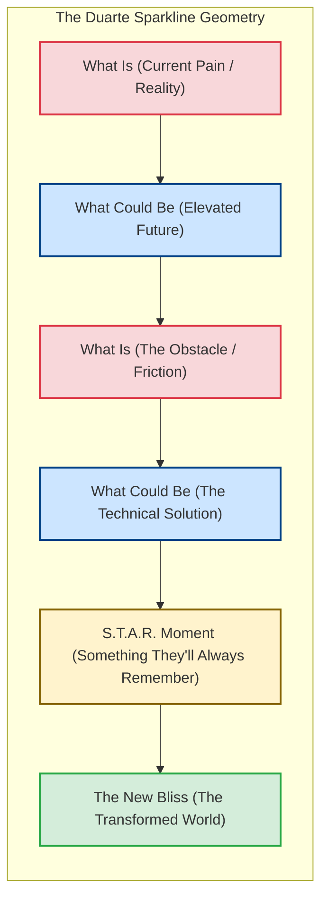

# Duarte Sparkline Methodology Specification: Transformative Presentations & Pitches
**The-Plan-Software Communication Engine: Cognitive Architecture & Jev Wire Catalog**

---

## 1. Executive Summary & Why the Sparkline Exists

Most technical presentations, conference keynotes, and startup pitches fail because they are designed as **informational data dumps** rather than **narrative transformations**. Presenters recite feature lists, technical diagrams, and bulleted slides, leaving the audience cognitively overloaded and emotionally uninspired.

The **Sparkline Presentation Framework** was created by Nancy Duarte in *Resonate: Present Visual Stories That Transform Audiences* (2010). By reverse-engineering the structural geometry of the greatest speeches in modern history (including Steve Jobs' 2007 iPhone launch, Martin Luther King Jr.'s "I Have a Dream", and JFK's Moonshot address), Duarte discovered a hidden, recurring architectural cadence. Formally documented in Nasir's *The Plan* (Sections 2.2.10 & 3.4.10), the Sparkline structures public speaking as a rhythmic oscillation between the baseline reality and an elevated future.



### The 5 Structural Pillars of Duarte's Sparkline
1. **The Audience is the Hero (The Presenter is the Mentor):** The speaker is not Luke Skywalker; the audience is Luke Skywalker. The speaker is Yoda, providing the wisdom and tool that empowers the hero to triumph.
2. **The Rhythmic Oscillation:** Continuously alternating between **"What Is"** (the painful, constrained, familiar current reality) and **"What Could Be"** (the inspiring, transformed alternative).
3. **The Call to Adventure:** Explicitly challenging the audience to cross the threshold of change and abandon the status quo.
4. **The S.T.A.R. Moment (Something They'll Always Remember):** A dramatized peak moment—a startling demonstration, a shocking metric, a memorable metaphor, or a dramatic reveal (e.g., Steve Jobs pulling the MacBook Air from a manila envelope).
5. **The New Bliss:** Concluding with a vivid, inspiring picture of how the world will fundamentally operate if the audience adopts the proposed vision.

---

## 2. Core Presentation Principles & Realistic Nuances

### Principle 1: The Hook in the First 30 Seconds (Banish Throat-Clearing)
* Amateurs waste the first 60 seconds with boring "throat-clearing" (*"Hello, thank you for having me, my name is X and today I'm going to talk about..."*).
* Sparkline masters hook the audience within 15–30 seconds with a provocative question, a shocking statistic, or an immersive story that reveals the acute friction in "What Is".

### Principle 2: Polarization Creates Movement (The Contrast Engine)
* If a pitch stays entirely in "What Is", it feels depressing and stagnant.
* If a pitch stays entirely in "What Could Be", it feels like ungrounded, utopian vaporware.
* **The Magic is the Alternation:** The contrast between the friction of today and the elegance of tomorrow creates narrative tension that propels the audience forward.

### Principle 3: Concrete Demonstrations Over Abstract Adjectives
* Rather than saying *"our software is incredibly fast and efficient"*, describe the concrete reality: *"Right now, your engineers wait 45 minutes for CI test builds to pass [What Is]. With our distributed cache, that drops to 90 seconds [What Could Be]."*

### Principle 4: The New Bliss Must Feel Achievable
* The conclusion should not be a corporate shrug (*"and that's our roadmap"*).
* It must paint the **New Bliss**: the transformed operational standard where the audience achieves victory, peace of mind, or market leadership.

---

## 3. Generative Scenario Engine for Sparkline (Gemini API)

Sparkline scenarios simulate high-stakes public speaking, startup investor pitches, developer conference keynotes, and company-wide all-hands presentations.

### 3.1 System Instruction for Gemini
```text
You are the Scenario Architect for an executive communication training platform.
Your task is to generate high-stakes presentation and pitch scenarios specifically designed to test Nancy Duarte's Sparkline framework (Resonate).

Target Framework: DUARTE_SPARKLINE
User Domain: {user_domain}
Difficulty: {difficulty_level}
Focus Theme: {focus_theme}

Output a strictly typed JSON object:
{
  "scenario_id": "unique_kebab_slug",
  "title": "Short 3-5 word title",
  "context_background": "2-3 sentences detailing a high-stakes keynote, investor demo, or all-hands meeting where an audience must be moved from complacency to action.",
  "prompt_question": "A challenge instructing the user: 'Deliver the opening 2-minute pitch of your presentation using the Duarte Sparkline structure.'",
  "key_success_factors": [
    "Sharp opening hook in the first 30 seconds",
    "Continuous rhythmic oscillation between 'What Is' and 'What Could Be'",
    "A memorable S.T.A.R. moment and inspiring New Bliss"
  ],
  "target_duration_seconds": 120
}

Rules:
1. Ground scenarios in transformative tech events: pitching an African B2B marketplace to Silicon Valley VCs, announcing an open-source framework at a major developer conference, rallying an engineering team through a massive cloud migration.
2. The user delivers a spoken address to an audience.
```

### 3.2 Sample Sparkline Scenarios
* **Scenario A (Startup Founder Pitching AWUN to Seed Investors):**
  * *Context:* "You are on stage at Demo Day pitching your marketplace platform (AWUN) to 200 angel and institutional investors in Lagos."
  * *Prompt:* *"Step up to the microphone. Deliver your 2-minute opening pitch using Duarte's Sparkline to contrast the chaotic fragmentation of informal commerce with your unified software platform."*
* **Scenario B (VP of Engineering Keynote - The Chaos Engineering Shift):**
  * *Context:* "Your engineering organization suffered three catastrophic production outages last quarter. You are addressing 150 engineers at the quarterly all-hands."
  * *Prompt:* *"Deliver your keynote opening using the Sparkline to move the engineering team from fear of production to an empowered culture of automated resilience and chaos testing."*

---

## 4. Jev System One Wire Catalog: Comprehensive Sparkline Suite

Below is the complete, criteria-rich specification for evaluating a user's Sparkline presentation response using TypeSafe AI's Jev model.

### 4.1 State Structure
```json
{
  "scenario_prompt": "Deliver your 2-minute opening pitch for your marketplace platform (AWUN) to seed investors using the Duarte Sparkline.",
  "scenario_context": "Founder pitching AWUN marketplace; informal commerce fragmentation in Nigeria; seed investors looking for massive market opportunity.",
  "target_framework": "DUARTE_SPARKLINE",
  "speaker_role": "Startup Founder / CEO",
  "transcript": "Across Nigeria today, over 40 million informal merchants run their businesses entirely on paper notebooks and WhatsApp screenshots [What Is]. When a payment fails or inventory runs out, they lose their livelihood in hours [What Is]. But imagine if every merchant had a cloud-native ERP and instant settlement terminal in the palm of their hand [What Could Be]. Today, an order takes 3 days to verify manually [What Is]; with AWUN, it clears in 4 seconds with zero reconciliation errors [What Could Be]. Last month, a single solar vendor in Kano processed ₦12M through our beta without a single dispute [S.T.A.R. Moment]. When you invest in AWUN, you aren't just funding an app—you are unlocking the digital backbone of West African commerce [The New Bliss]...",
  "word_count": 138,
  "duration_seconds": 58,
  "words_per_minute": 142
}
```

---

### 4.2 The Six Core Sparkline Questions Submitted to Jev

> **Cross-cutting clarity:** in addition to the framework questions below, every catalog includes the two shared
> clarity/ambiguity questions (`clarity_of_response`, `ambiguity_presence`), graded as a standalone metric that does
> not affect the composite score. See [clarity.md](./clarity.md).

#### Question 1: `sparkline_what_is_vs_could_be_contrast` (Primitive: `score`)
```json
{
  "type": "score",
  "instructions": "Assess the core structural engine of Nancy Duarte's Sparkline in `transcript`: the rhythmic oscillation between 'What Is' (the painful, constrained, familiar current reality) and 'What Could Be' (the inspiring, elevated future state). Does the speaker create clear, deliberate contrast between current friction and future promise, or do they give a flat, one-dimensional recitation?",
  "criteria": {
    "Level 1": "Flat / Monotone: Purely descriptive or feature-heavy. No contrast created between current problems and future vision; reads like a flat instruction manual.",
    "Level 2": "Weak Contrast: Mentions a problem and a solution once, but does so mechanically without building dramatic tension or rhythmic back-and-forth.",
    "Level 3": "Adequate Contrast: Clear separation between the status quo ('What Is') and the proposed future ('What Could Be'), but oscillation is clumsy or unbalanced.",
    "Level 4": "Strong Dynamic Rhythm: Excellent rhythmic cadence. The speaker repeatedly alternates between the pain of current reality and the elegance of the proposed solution, creating compelling narrative momentum.",
    "Level 5": "Masterful Oratorical Oscillation: Flawless Duarte geometry. The contrast is palpable, visceral, and electrifying. The audience experiences the weight of current constraints and the exhilarating relief of the transformed future."
  }
}
```

#### Question 2: `sparkline_audience_as_hero` (Primitive: `choice`)
```json
{
  "type": "choice",
  "instructions": "Evaluate whether the speaker positions the AUDIENCE as the hero of the story in `transcript`, as mandated by Duarte's doctrine. The speaker must act as the mentor/guide (Yoda), providing the tools, vision, and call to action that empowers the audience (Luke Skywalker) to achieve greatness. Penalize self-aggrandizing pitches where the speaker frames themselves as the omnipotent hero.",
  "criteria": {
    "audience_is_the_hero": "The speaker frames the audience (investors, engineers, users) as the heroes of the journey, showing how adopting this idea empowers THEM to transform the industry or solve the crisis.",
    "speaker_centered_ego": "The speaker frames themselves or their company as the sole hero, boasting about their own brilliance while treating the audience as passive spectators.",
    "neutral_detached": "Neither the audience nor the speaker is emotionally centered; the delivery is cold, academic, or detached."
  }
}
```

#### Question 3: `sparkline_hook_first_30s` (Primitive: `score`)
```json
{
  "type": "score",
  "instructions": "Assess the opening 30 seconds of `transcript`. In high-stakes presentations, the opening dictates audience attention. Does the speaker open with an immediate, gripping hook (a startling statistic, provocative question, or vivid story) or do they waste time with boring throat-clearing ('Hello, my name is X, thank you for coming...')?",
  "criteria": {
    "Level 1": "Boring Throat-Clearing: Opens with apologetic, generic, or bureaucratic pleasantries ('Good morning, can everyone hear me? Today I'm going to present...'). Zero hook.",
    "Level 2": "Weak Opening: Mildly interesting topic statement, but lacks urgency, emotion, or tension.",
    "Level 3": "Standard Professional Hook: Opens with a clear problem statement or industry fact that captures moderate attention.",
    "Level 4": "Compelling Hook: Opens with an arresting data point, vivid human story, or provocative contrast that immediately commands silence and engagement.",
    "Level 5": "Electrifying First 30 Seconds: Jaw-dropping opening. Completely grabs the room in the first two sentences through a startling revelation, brilliant metaphor, or visceral challenge."
  }
}
```

#### Question 4: `sparkline_star_moment_presence` (Primitive: `choice`)
```json
{
  "type": "choice",
  "instructions": "Determine whether the speaker includes a S.T.A.R. Moment (Something They'll Always Remember) in `transcript`. A S.T.A.R. moment is a memorable emotional anchor: a shocking proof point, an evocative customer vignette, a vivid demonstration, or an unforgettable metaphor that sticks in the audience's memory long after the talk.",
  "criteria": {
    "star_moment_present": "Contains an unforgettable anchor: a dramatic proof point, vivid customer case study, memorable metaphor, or tangible demonstration that stands out.",
    "generic_claim_only": "Makes general claims and mentions data, but lacks a dramatic, unforgettable showcase moment.",
    "absent": "Purely dry abstract text with zero memorable highlights."
  }
}
```

#### Question 5: `sparkline_new_bliss_vision` (Primitive: `choice`)
```json
{
  "type": "choice",
  "instructions": "Evaluate the conclusion of `transcript`. In Duarte's framework, a great presentation does not end with a generic 'Thank you, any questions?' slide. It concludes with 'The New Bliss': painting an inspiring, vivid picture of how the world will be permanently elevated and transformed if the audience joins the cause.",
  "criteria": {
    "inspiring_new_bliss": "Concludes with an inspiring, vivid, and expansive description of the transformed future state. Leaves the audience energized and clear on the stakes.",
    "flat_logistical_ending": "Ends with a boring administrative slide ('That's all I have, questions?'), abruptly trailing off without an inspiring vision.",
    "absent_or_unresolved": "Cuts off awkwardly without a formal conclusion."
  }
}
```

#### Question 6: `sparkline_call_to_adventure` (Primitive: `choice`)
```json
{
  "type": "choice",
  "instructions": "Determine whether the speaker issues a clear, unmistakable Call to Adventure in `transcript`, challenging the audience to cross the threshold, commit resources, or take decisive action.",
  "criteria": {
    "clear_call_to_adventure": "Issues an explicit, inspiring challenge or invitation to the audience to act, invest, or adopt the vision.",
    "vague_invitation": "Mentions that 'it would be nice if people got involved', but lacks an explicit call to action.",
    "absent": "No call to action or challenge presented."
  }
}
```

---

## 5. Deterministic Scoring & Real-Time Coaching Engine (Sparkline)

In the Sparkline Framework, the **Contrast Engine (What Is vs. What Could Be)** ($35\%$) and **Opening Hook** ($25\%$) carry the greatest weight.

### 5.1 Sparkline Composite Score Formulation

$$Score_{\text{Sparkline}} = (W_C \times S_C) + (W_H \times S_H) + (W_A \times P_A) + (W_S \times P_S) + (W_N \times P_N) + (W_T \times P_T)$$

* **Contrast Engine Score ($W_C = 35\%$ — Heaviest Weight!):** Normalized Score $\frac{\text{Level}}{5.0}$.
* **Opening Hook Score ($W_H = 25\%$):** Normalized Score $\frac{\text{Level}}{5.0}$.
* **Audience as Hero ($W_A = 15\%$):** `audience_is_the_hero` = $1.0$, `neutral_detached` = $0.5$, `speaker_centered_ego` = $0.1$.
* **S.T.A.R. Moment ($W_S = 10\%$):** `star_moment_present` = $1.0$, `generic_claim_only` = $0.4$, `absent` = $0.0$.
* **The New Bliss ($W_N = 10\%$):** `inspiring_new_bliss` = $1.0$, `flat_logistical_ending` = $0.3$, `absent_or_unresolved` = $0.0$.
* **Call to Adventure ($W_T = 5\%$):** `clear_call_to_adventure` = $1.0$, `vague_invitation` = $0.4$, `absent` = $0.0$.

---

### 5.2 Real-Time Coaching Triggers (Sparkline Specific)

| Jev Evaluation Trigger | UI Badge | Deterministic Coaching Advice |
| :--- | :--- | :--- |
| `sparkline_what_is_vs_could_be_contrast.choice >= "Level 4"` | ⚡ **Duarte Cadence Master** | *"Outstanding oratorical rhythm. You created compelling narrative tension by continuously oscillating between the pain of current reality and the promise of the future."* |
| `sparkline_hook_first_30s.choice <= "Level 2"` | 🥱 **Throat-Clearing Warning** | *"You opened with boring pleasantries or administrative setup. In high-stakes talks, grab the room in the first 15 seconds: open with a startling metric, provocative question, or vivid story."* |
| `sparkline_what_is_vs_could_be_contrast.choice <= "Level 2"` | 📉 **Flat Information Dump** | *"Your presentation felt like a flat feature list. Build dynamic contrast: show what is broken or painful today, then contrast it directly with what could be."* |
| `sparkline_audience_as_hero.choice == "speaker_centered_ego"` | 👑 **Ego Trap Alert** | *"You framed yourself or your company as the sole hero. In Duarte's doctrine, the audience is Luke Skywalker; you are Yoda. Show how adopting your idea makes THEM triumphant."* |
| `sparkline_star_moment_presence.choice == "star_moment_present"` | 🌟 **S.T.A.R. Moment Delivered** | *"Great job including a memorable showcase moment. Unforgettable proof points and vivid case studies stick in the audience's memory long after the talk."* |
| `sparkline_new_bliss_vision.choice == "inspiring_new_bliss"` | 🌅 **The New Bliss Achieved** | *"Inspiring conclusion. You ended not on logistics, but on an elevated vision of how the world will operate once this mission is accomplished."* |
