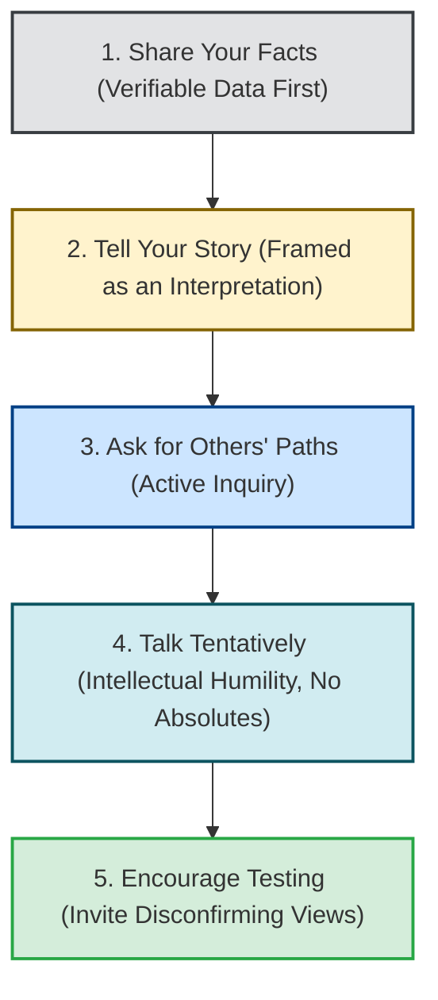

# STATE Methodology Specification: Crucial Conversations Protocol
**The-Plan-Software Communication Engine: Cognitive Architecture & Jev Wire Catalog**

---

## 1. Executive Summary & Why STATE Exists

When opinions differ, stakes are high, and emotions run strong, human communication almost invariably devolves into one of two destructive failure modes:
1. **Silence (Masking, Avoiding, Withdrawing):** Withholding critical truth to preserve surface harmony, allowing architectural flaws, safety violations, or cultural toxicity to fester.
2. **Violence (Controlling, Labeling, Attacking):** Forcing one's opinion on others through dogmatic aggression, executive fiat, or emotional intimidation.

The **STATE Protocol** was developed by Kerry Patterson, Joseph Grenny, Ron McMillan, and Al Switzler in *Crucial Conversations: Tools for Talking When Stakes Are High* (2002), based on 25+ years of research observing the top 5% of organizational communicators. Cited extensively in Nasir's *The Plan* (Sections 2.2.3 & 3.4.3), STATE provides an operational algorithm for entering high-stakes, emotionally charged dialogue without retreating into silence or escalating into hostility.



### The 5 Elements of STATE
| Letter | Step | What to Do | What NOT to Do |
| :---: | :--- | :--- | :--- |
| **S** | **Share your facts** | Lead with the least controversial, most observable, and verifiable data (timestamps, PRs, metric logs, written goals). | Do NOT lead with emotional conclusions or accusations (*"You don't care about quality"*). |
| **T** | **Tell your story** | Frame your conclusion as a personal interpretation (*"The story I'm telling myself is...", "It makes me wonder if..."*). | Do NOT present subjective interpretations as incontrovertible facts. |
| **A** | **Ask for their path** | Actively invite their data and perspective (*"Help me understand how you see it", "What was happening from your vantage point?"*). | Do NOT ask rhetorical traps or patronizing cross-examinations. |
| **T** | **Talk tentatively** | Use measured, humble language (*"It appears to me", "Perhaps", "I could be missing something"*). | Banish dogmatic absolutes (*"Obviously", "Clearly", "You always", "There is no doubt"*). |
| **E** | **Encourage testing** | Actively invite dissent and counter-evidence (*"Do you see this differently?", "If I've got this wrong, please challenge me"*). | Do NOT fish for forced agreement or nod-along compliance. |

---

## 2. Core Evaluation Principles & Realistic Nuances

### Principle 1: Master Your Stories (Data $\rightarrow$ Story $\rightarrow$ Emotion $\rightarrow$ Action)
* In cognitive psychology, emotions do not come directly from external events; they come from the **story** we tell ourselves about the data.
* *Example Data:* A teammate committed a hotfix directly to main without tests.
* *Villain Story:* *"He thinks he's above the rules and has zero respect for my authority."* (Leads to anger and attack).
* *Mastered Story:* *"He committed directly to main. He was likely panicking about the downtime. Let me verify why before assuming bad intent."*
* The speaker must clearly separate **what happened (data)** from **what it meant (story)**.

### Principle 2: Facts are Safe and Persuasive
* People argue with stories, but they cannot reasonably argue with camera-recordable facts.
* Leading with: *"In the last three sprints, four database PRs were merged without passing CI gates [Fact]"* anchors the conversation in objective reality.
* Leading with: *"You have no respect for our engineering standards [Story]"* triggers an instant defensive explosion.

### Principle 3: Tentative Language is Strength, Not Weakness
* Amateurs believe that being firm requires using words like *"obviously"*, *"without question"*, *"clearly"*, and *"you always"*.
* High-stakes masters understand that **dogmatic absolutes shut down dialogue**. Speaking tentatively (*"From where I sit, it looks like...", "My concern is that..."*) demonstrates intellectual security and creates psychological safety while upholding rigorous standards.

### Principle 4: Establishing Mutual Purpose
* Before diving into sensitive conflict, the speaker must establish **Mutual Purpose** (*"We both want this launch to succeed without customer downtime"*, *"Our shared goal is keeping this client's trust"*).
* This eliminates the "Fool's Choice" (believing you must choose between speaking the truth or preserving the relationship).

---

## 3. Generative Scenario Engine for STATE (Gemini API)

STATE scenarios test the user's composure, factual discipline, and dialogue skills under intense emotional or professional friction.

### 3.1 System Instruction for Gemini
```text
You are the Scenario Architect for an executive leadership communication platform.
Your task is to generate realistic high-stakes conflict scenarios specifically designed to test the STATE protocol from Crucial Conversations.

Target Framework: STATE
User Domain: {user_domain}
Difficulty: {difficulty_level}
Focus Theme: {focus_theme}

Output a strictly typed JSON object:
{
  "scenario_id": "unique_kebab_slug",
  "title": "Short 3-5 word title",
  "context_background": "2-3 sentences detailing an emotionally charged workplace disagreement, broken commitment, or leadership conflict with high stakes.",
  "prompt_question": "A challenge instructing the user: 'How do you initiate this high-stakes conversation with your counterpart using the STATE protocol?'",
  "key_success_factors": [
    "Lead with verifiable facts before emotional interpretations",
    "Frame conclusions as a tentative story rather than absolute truth",
    "Establish mutual purpose and invite counter-perspectives"
  ],
  "target_duration_seconds": 90
}

Rules:
1. Ground scenarios in authentic friction (e.g., pushing back on an executive demanding to bypass security tests, confronting a co-founder about unaligned spending, addressing a peer who undermined your project).
2. The user speaks directly to the counterpart face-to-face.
```

### 3.2 Sample STATE Scenarios
* **Scenario A (Staff Engineer to VP of Product - Unrealistic Release Mandate):**
  * *Context:* "Your VP of Product announced to executive leadership that the mobile payment overhaul will ship on Friday. You know that performance benchmarking under load has not even started, and shipping now risks massive customer payment failures."
  * *Prompt:* *"You schedule an urgent private 1-on-1 with the VP of Product. How do you raise this issue using the STATE protocol without sounding obstructionist or accusatory?"*
* **Scenario B (Co-Founder Disagreement - Equity & Commitment):**
  * *Context:* "Your technical co-founder has missed the last three investor update meetings and has reduced their working hours significantly while retaining an equal equity split."
  * *Prompt:* *"Sit down with your co-founder and address this sensitive commitment issue directly using the STATE framework."*

---

## 4. Jev System One Wire Catalog: Comprehensive STATE Suite

Below is the complete, criteria-rich specification for evaluating a user's STATE response using TypeSafe AI's Jev model.

### 4.1 State Structure
```json
{
  "scenario_prompt": "You schedule an urgent 1-on-1 with the VP of Product who announced an un-benchmarked Friday release. Use the STATE protocol.",
  "scenario_context": "Staff Engineer addressing VP of Product; Friday launch announced to CEO; load testing incomplete; high risk of payment outages.",
  "target_framework": "STATE",
  "speaker_role": "Staff Engineer",
  "transcript": "Thanks for taking the time to speak, David. I know we are both laser-focused on hitting our Q4 revenue target and maintaining client trust [Mutual Purpose]. Yesterday, you announced to the board that our payment service will ship this Friday [Share Facts]. Right now, our automated load testing suite has only executed 20% of its load scripts, and yesterday's run showed connection pool exhaustion at 2,000 RPS [Share Facts]. That leads me to worry that if we launch on Friday, we run a severe risk of dropping customer transactions during peak hours [Tell Story]. It seems to me that our safest path is a 48-hour canary rollout to 5% of users [Talk Tentatively]. I want to understand what pressures you're managing with the board, and if you see this risk differently, I really want to hear it [Ask & Encourage Testing].",
  "word_count": 142,
  "duration_seconds": 64,
  "words_per_minute": 133
}
```

---

### 4.2 The Six Core STATE Questions Submitted to Jev

> **Cross-cutting clarity:** in addition to the framework questions below, every catalog includes the two shared
> clarity/ambiguity questions (`clarity_of_response`, `ambiguity_presence`), graded as a standalone metric that does
> not affect the composite score. See [clarity.md](./clarity.md).

#### Question 1: `state_facts_first_sequencing` (Primitive: `noul`)
```json
{
  "type": "noul",
  "instructions": "Determine whether the speaker in `transcript` adheres to the fundamental sequencing rule of Crucial Conversations: Share your Facts FIRST. Assess whether the speaker anchors the dialogue with objective, verifiable, and observable data (announcements made, metrics logged, PRs merged, written agreements) BEFORE sharing their emotional conclusions, stories, or demands.",
  "criteria": {
    "yes": "The speaker explicitly leads with concrete, observable facts before introducing their subjective interpretation or concern.",
    "no": "The speaker leads with an emotional conclusion, accusation, grievance, or demand before presenting factual data."
  }
}
```

#### Question 2: `state_story_framing_awareness` (Primitive: `choice`)
```json
{
  "type": "choice",
  "instructions": "Evaluate how the speaker frames their conclusion or concern in `transcript`. In the STATE protocol, 'Tell your story' requires the speaker to acknowledge their conclusion as an interpretation or mental model ('The conclusion I'm beginning to draw is...', 'It makes me worry that...'), rather than presenting their personal inference as undisputed universal truth.",
  "criteria": {
    "properly_framed_as_story": "The speaker clearly frames their conclusion as an interpretation, hypothesis, or concern (e.g., 'That leads me to worry that...', 'The story I'm telling myself is...'). Distinguishes facts from personal meaning.",
    "story_stated_as_absolute_truth": "The speaker states their subjective interpretation as an incontrovertible fact (e.g., 'You obviously don't care about system stability', 'This proves the timeline is impossible').",
    "absent": "The speaker recites raw facts but never states their conclusion, leaving the listener confused about the point of the conversation."
  }
}
```

#### Question 3: `state_tentative_language_calibration` (Primitive: `score`)
```json
{
  "type": "score",
  "instructions": "Assess the 'Talk Tentatively' dimension of `transcript`. Evaluate whether the speaker uses measured, non-dogmatic phrasing ('It seems to me', 'From my vantage point', 'Perhaps', 'I'm concerned that') versus dogmatic absolutes ('You always', 'Obviously', 'Clearly', 'There is no question', 'You never'). In Crucial Conversations, tentative language embodies intellectual humility that keeps dialogue open.",
  "criteria": {
    "Level 1": "Highly Dogmatic & Aggressive: Heavy use of categorical absolutes and combative declarations ('You always ignore engineering advice', 'Obviously you don't care'). Shuts down dialogue.",
    "Level 2": "Mostly Dogmatic: Primarily absolute with rare, superficial polite softeners. The underlying stance remains rigid and unyielding.",
    "Level 3": "Balanced: Expresses concerns clearly without aggressive dogmatism, but occasionally phrases interpretations as universal facts.",
    "Level 4": "Consistently Tentative & Measured: Clearly separates data from hypothesis; uses thoughtful qualifiers ('From what the data shows', 'My concern is that') while remaining unwavering on the core standard.",
    "Level 5": "Masterful Calibration: Perfect blend of intellectual humility and steadfast conviction. Frames perspective as an invitation to collaborative inquiry with zero defensiveness or arrogance."
  }
}
```

#### Question 4: `state_mutual_purpose_safety` (Primitive: `choice`)
```json
{
  "type": "choice",
  "instructions": "Evaluate whether the speaker establishes or reinforces Mutual Purpose in `transcript`. Mutual Purpose establishes a common goal or shared value ('We both want this project to succeed', 'Our shared priority is customer trust') that reassures the counterpart of psychological safety and shared intent.",
  "criteria": {
    "explicit_mutual_purpose": "The speaker explicitly affirms a shared commitment or common objective before or during the conversation, establishing common ground.",
    "implied_collaborative": "Not stated as a standalone sentence, but the entire tone is respectful, problem-solving oriented, and unthreatening.",
    "adversarial_me_vs_you": "Zero mutual purpose; frames the conversation as an adversarial zero-sum conflict (me vs. you)."
  }
}
```

#### Question 5: `state_ask_and_encourage_testing` (Primitive: `choice`)
```json
{
  "type": "choice",
  "instructions": "Evaluate the 'Ask for their path' and 'Encourage testing' dimensions of `transcript`. Does the speaker genuinely invite the counterpart to share their data, explain their perspective, and challenge the speaker's conclusions ('Do you see this differently?', 'Help me understand what you're seeing from your side')?",
  "criteria": {
    "genuine_inquiry_and_testing": "The speaker genuinely invites the other party's perspective and explicitly asks them to challenge or correct the speaker's conclusion if they see it differently.",
    "token_or_rhetorical_question": "Asks a superficial or rhetorical question with zero genuine interest in understanding (e.g., 'Right?', 'Don't you agree?').",
    "zero_inquiry_closed": "The speaker monologues without asking a single question or inviting the counterpart to speak."
  }
}
```

#### Question 6: `state_emotional_composure` (Primitive: `score`)
```json
{
  "type": "score",
  "instructions": "Assess the overall emotional regulation, composure, and psychological maturity of `transcript`. In high-stakes disputes, leaders must regulate their nervous system, avoiding both flight (timid silence) and fight (combative aggression).",
  "criteria": {
    "Level 1": "Hostile / Dysregulated: Overtly angry, defensive, sarcastic, or aggressively confrontational.",
    "Level 2": "Visibly Agitated or Anxious: Noticeable frustration, trembling urgency, or defensive hedging.",
    "Level 3": "Professionally Controlled: Controlled professional demeanor, though slightly tense.",
    "Level 4": "Calm & Grounded: Measured breathing, steady cadence, respectful and clear under pressure.",
    "Level 5": "Exemplary Poise & Presence: Radiant psychological safety, profound calm, and effortless authority under high emotional stakes."
  }
}
```

---

## 5. Deterministic Scoring & Real-Time Coaching Engine (STATE)

In STATE, **Facts-First Sequencing** ($20\%$), **Tentative Language** ($25\%$), and **Active Inquiry/Testing** ($20\%$) govern the composite score.

### 5.1 STATE Composite Score Formulation

$$Score_{\text{STATE}} = (W_F \times P_F) + (W_S \times P_S) + (W_T \times S_T) + (W_M \times P_M) + (W_A \times P_A) + (W_C \times S_C)$$

* **Facts-First Sequencing ($W_F = 20\%$):** `yes` = $1.0$, `no` = $0.0$.
* **Story Framing ($W_S = 15\%$):** `properly_framed_as_story` = $1.0$, `story_stated_as_absolute_truth` = $0.2$, `absent` = $0.1$.
* **Tentative Language ($W_T = 25\%$):** Normalized Score $\frac{\text{Level}}{5.0}$.
* **Mutual Purpose ($W_M = 10\%$):** `explicit_mutual_purpose` = $1.0$, `implied_collaborative` = $0.7$, `adversarial_me_vs_you` = $0.0$.
* **Ask & Encourage Testing ($W_A = 20\%$):** `genuine_inquiry_and_testing` = $1.0$, `token_or_rhetorical_question` = $0.3$, `zero_inquiry_closed` = $0.0$.
* **Emotional Composure ($W_C = 10\%$):** Normalized Score $\frac{\text{Level}}{5.0}$.

---

### 5.2 Real-Time Coaching Triggers (STATE Specific)

| Jev Evaluation Trigger | UI Badge | Deterministic Coaching Advice |
| :--- | :--- | :--- |
| `state_facts_first_sequencing.yes >= 0.8` AND `state_tentative_language_calibration.choice >= "Level 4"` | 🛡️ **Crucial Mastery** | *"Exemplary high-stakes dialogue. You led with undeniable facts, framed your concerns with intellectual humility, and preserved psychological safety."* |
| `state_facts_first_sequencing.yes < 0.3` | 🔴 **Accusatory Lead** | *"You led with your emotional conclusion or grievance rather than data. In high-stakes disputes, state observable facts first (dates, PRs, metrics) before sharing your story."* |
| `state_tentative_language_calibration.choice <= "Level 2"` | ⚠️ **The Dogmatic Trap** | *"You used dogmatic absolutes ('You always', 'Obviously', 'There is no question'). Absolutes provoke instant resistance. Soften your delivery: 'It appears to me', 'My concern is that'."* |
| `state_story_framing_awareness.choice == "story_stated_as_absolute_truth"` | ⚠️ **Story as Fact Alert** | *"You stated your interpretation as an incontrovertible fact. Remember: facts are verifiable; stories are mental models. Frame your conclusion as: 'The story I'm telling myself is...'."* |
| `state_ask_and_encourage_testing.choice != "genuine_inquiry_and_testing"` | 🤐 **Monologue Warning** | *"You failed to genuinely invite the other party's perspective. In Crucial Conversations, dialogue requires inquiry: ask 'How do you see this differently?'."* |
| `state_mutual_purpose_safety.choice == "adversarial_me_vs_you"` | ⚔️ **Adversarial Framing** | *"You framed the disagreement as me-vs-you. Establish Mutual Purpose first: remind them of your shared goal (e.g., 'We both want this launch to succeed')."* |
