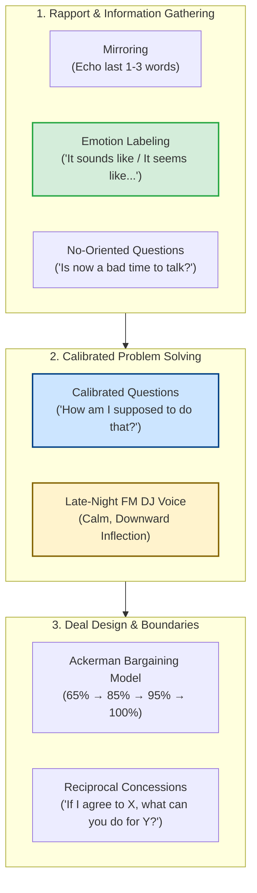

# Voss Tactical Empathy Methodology Specification: High-Stakes Negotiation
**The-Plan-Software Communication Engine: Cognitive Architecture & Jev Wire Catalog**

---

## 1. Executive Summary & Why Voss Tactical Empathy Exists

Traditional negotiation training teaches rational game theory, mathematical compromises, and "splitting the difference." In practice, these methods fail because **human decision-making is driven by unaddressed emotional fears, cognitive biases, and the need for autonomy**.

The **Tactical Empathy Framework** was developed by Chris Voss (former Lead International Kidnapping Negotiator for the FBI) in *Never Split the Difference: Negotiating As If Your Life Depended On It* (2016). Formally featured in Nasir's *The Plan* (Sections 2.2.7, 3.4.7, & Table 4.6), Tactical Empathy is an intelligence-gathering protocol. It shifts negotiation from an adversarial tug-of-war to a collaborative problem-solving dynamic where the counterpart does the heavy lifting.



---

## 2. Core Negotiation Principles & Behavioral Nuances

### Principle 1: Negotiation is an Information-Gathering Exercise
* The party doing the most talking is losing the negotiation. 
* Amateurs attempt to argue, convince, and steamroll. Masters ask calibrated questions and label emotions to uncover the counterpart's "Black Swans" (hidden motivations, internal pressures, and constraints).

### Principle 2: Emotion Labeling (Sensory Stems, Banish "I")
* **The Rule of Labeling:** Neutralize negative emotions and amplify positive ones by naming them dispassionately using sensory stems:
  * *"It sounds like you're under intense pressure to hit this deadline."*
  * *"It seems like you feel your team's contributions are being overlooked."*
  * *"It feels like there's a constraint here we haven't discussed yet."*
* **The Toxic Mistake:** Using first-person language (*"I understand how you feel"* or *"I hear you"*). First-person framing centers the speaker and triggers defensive skepticism (*"No you don't!"*).

### Principle 3: Calibrated "How" & "What" Questions (Banish "Why")
* **Passing the Mental Burden:** Calibrated questions use "How" or "What" to invite the counterpart to solve your problem for you:
  * *"How am I supposed to do that?"* (The supreme non-confrontational pushback).
  * *"What about this proposal doesn't work for your team?"*
  * *"How does this move us closer to our launch date?"*
* **Banish "Why":** In almost every language and culture, "Why" triggers instinctual defensiveness (*"Why did you change the pricing?"* $\rightarrow$ Counterpart feels accused and doubles down). Replace with: *"What led to the change in pricing?"*

### Principle 4: Get to "No" Early (Autonomy & Psychological Safety)
* Forcing a counterpart to say "Yes" (*"Do you want to save money?"*) makes them feel manipulated and defensive.
* Saying "No" makes humans feel safe, protected, and in control. Voss advocates asking questions engineered for a "No":
  * *"Is this a bad time to talk?"*
  * *"Have you completely walked away from this project?"*
  * *"Would it be ridiculous to propose a phased rollout?"*

### Principle 5: The "Late-Night FM DJ Voice"
* When negotiation gets tense, pitch and pace dictate outcomes.
* Fast, high-pitched speech conveys anxiety, desperation, or aggression.
* The **Late-Night FM DJ Voice** is calm, slow, reassuring, and downward-inflecting. It triggers neuro-chemical calm (oxytocin release) in the listener's brain.

### Principle 6: The Ackerman Model & Reciprocal Concessions
* **Never Split the Difference:** Splitting the difference in half is a lazy compromise that leaves both sides bitter.
* **The Reciprocity Rule:** Never give away a concession without demanding something in return:
  * *"If I agree to maintain that SLA, what can you do on contract duration?"*

---

## 3. Generative Scenario Engine for Voss Negotiation (Gemini API)

Voss scenarios place the user in high-stakes pricing, contract, salary, or deadline negotiations where the counterpart starts with aggressive or rigid demands.

### 3.1 System Instruction for Gemini
```text
You are the Scenario Architect for an executive leadership communication platform.
Your task is to generate realistic high-stakes negotiation scenarios specifically designed to test Chris Voss's Tactical Empathy framework (Never Split the Difference).

Target Framework: VOSS_NEGOTIATION
User Domain: {user_domain}
Difficulty: {difficulty_level}
Focus Theme: {focus_theme}

Output a strictly typed JSON object:
{
  "scenario_id": "unique_kebab_slug",
  "title": "Short 3-5 word title",
  "context_background": "2-3 sentences establishing a high-stakes negotiation with conflicting interests (e.g. enterprise vendor rate hike, salary negotiation, scope dispute).",
  "prompt_question": "The tough, rigid opening stance spoken by the counterpart.",
  "key_success_factors": [
    "Deployment of sensory emotion labels ('It sounds/seems like...')",
    "Calibrated 'How'/'What' questions without accusatory 'Why'",
    "Composed Late-Night FM DJ delivery with reciprocal concession framing"
  ],
  "target_duration_seconds": 90
}

Rules:
1. Ground scenarios in real tech business friction: vendor price hikes with short notice, enterprise clients demanding unpaid scope, salary negotiations with rigid bands.
2. The prompt_question must sound tough and uncompromising (e.g., 'Take it or leave it, our pricing is non-negotiable').
```

### 3.2 Sample Voss Scenarios
* **Scenario A (Cloud Infrastructure Vendor Price Hike):**
  * *Context:* "Your cloud database provider account manager announces a 35% across-the-board price increase effective in 14 days."
  * *Prompt:* *"The account manager says: 'Look, corporate updated our enterprise tiers globally. I can't offer exceptions. If you don't sign by Friday, your tier reverts to standard billing.' How do you negotiate using Voss principles?"*
* **Scenario B (Salary & Equity Negotiation):**
  * *Context:* "You are negotiating a Staff Engineer offer at a fast-growing scale-up. The recruiter claims the base salary is at the absolute top of the internal band."
  * *Prompt:* *"The recruiter says: 'We've given you our maximum base salary of ₦35M. That's the cap for this band, take it or leave it.' Respond using Tactical Empathy."*

---

## 4. Jev System One Wire Catalog: Comprehensive Voss Suite

Below is the complete, criteria-rich specification for evaluating a user's Voss negotiation response using TypeSafe AI's Jev model.

### 4.1 State Structure
```json
{
  "scenario_prompt": "The account manager says: 'Look, corporate updated our enterprise tiers globally. I can't offer exceptions. If you don't sign by Friday, your tier reverts to standard billing.'",
  "scenario_context": "Tech Founder negotiating with cloud vendor; sudden 35% rate hike; 14-day deadline; counterpart holding firm stance.",
  "target_framework": "VOSS_NEGOTIATION",
  "speaker_role": "Founder / Engineering Director",
  "transcript": "It sounds like you are under immense pressure from corporate leadership to enforce this new pricing tier across all accounts without exceptions [Emotion Label]. And it seems like your hands are completely tied regarding the base rate [Emotion Label]. I value our partnership over the last two years, but how am I supposed to absorb a 35% budget increase with only two weeks of notice before our fiscal year closes? [Calibrated Question]. Would it be ridiculous to look at an extended two-year agreement if you can grandfather our existing rate for the next two quarters? [No-Oriented Question & Reciprocal Concession].",
  "word_count": 105,
  "duration_seconds": 49,
  "words_per_minute": 128
}
```

---

### 4.2 The Six Core Voss Questions Submitted to Jev

> **Cross-cutting clarity:** in addition to the framework questions below, every catalog includes the two shared
> clarity/ambiguity questions (`clarity_of_response`, `ambiguity_presence`), graded as a standalone metric that does
> not affect the composite score. See [clarity.md](./clarity.md).

#### Question 1: `voss_emotion_labeling` (Primitive: `noul`)
```json
{
  "type": "noul",
  "instructions": "Determine whether the speaker in `transcript` utilizes Chris Voss's Tactical Empathy technique of Emotion Labeling. Valid emotion labels use sensory observation stems: 'It sounds like...', 'It seems like...', 'It feels like...', or 'It looks like...' to dispassionately name the counterpart's pressures, fears, or constraints. Strictly enforce the Voss Rule: Labels DO NOT use first-person self-centered language ('I understand how you feel' or 'I hear you' are NOT labels and must be marked 'no').",
  "criteria": {
    "yes": "The speaker deploys an authentic emotion label using sensory stems ('It sounds like...', 'It seems like...', 'It feels like...') to name the counterpart's pressure without using 'I'.",
    "no": "The speaker fails to label emotions, argues purely on logic, or uses self-centered phrasing ('I understand your position', 'I want you to know')."
  }
}
```

#### Question 2: `voss_calibrated_questions` (Primitive: `choice`)
```json
{
  "type": "choice",
  "instructions": "Analyze the questions asked by the negotiator in `transcript`. Under Voss's doctrine, calibrated questions start exclusively with 'How' or 'What' and gently guide the counterpart into solving the problem ('How am I supposed to do that?', 'What would it take to make this work?'). Accusatory 'Why' questions trigger defensiveness and destroy leverage.",
  "criteria": {
    "calibrated_how_what": "The speaker asks calibrated open-ended questions starting with 'How' or 'What' that pass the cognitive burden of problem-solving to the counterpart without provoking defensiveness.",
    "accusatory_why": "The speaker asks 'Why' questions that put the counterpart on trial and make them feel judged (e.g., 'Why can't you make an exception?', 'Why did your management do this?').",
    "closed_interrogation": "The speaker fires rapid closed yes/no questions or demands that corner the counterpart.",
    "no_questions_asked": "The speaker pleaded, argued, or stated demands without asking any diagnostic questions."
  }
}
```

#### Question 3: `voss_no_oriented_inquiry` (Primitive: `choice`)
```json
{
  "type": "choice",
  "instructions": "Evaluate whether the speaker in `transcript` utilizes a 'No-Oriented Question' to preserve the counterpart's psychological safety and autonomy (e.g., 'Is it a bad time to talk?', 'Have you given up on this deal?', 'Would it be ridiculous to suggest...?'). In Voss's doctrine, people feel protected when they say 'No'.",
  "criteria": {
    "no_oriented_question_present": "The speaker asks an intentional question designed to invite a safe 'No' to preserve autonomy and break an impasse.",
    "forcing_yes_manipulation": "The speaker asks forced, needy 'Yes' questions (e.g., 'Do you want to keep our business?', 'Don't you agree that's fair?').",
    "standard_neutral_phrasing": "The speaker uses standard neutral framing without specifically targeting a no-oriented response."
  }
}
```

#### Question 4: `voss_vocal_tone_estimate` (Primitive: `choice`)
```json
{
  "type": "choice",
  "instructions": "Assess the psychological stance and implied vocal delivery in `transcript`. Evaluate whether the negotiator embodies the 'Late-Night FM DJ Voice' (calm, slow, reassuring, non-reactive, downward-inflecting) versus aggressive combative posturing or submissive pleading.",
  "criteria": {
    "late_night_dj_calm": "Measured, calm, downward-inflecting, non-reactive, and emotionally regulated. Conveys quiet authority and deep empathy under pressure.",
    "assertive_professional": "Direct, businesslike, and polite, but transactional. Effective, though lacks tactical warmth.",
    "aggressive_combative": "Combative, demanding, issuing ultimatums, or expressing irritation. Provokes counter-resistance.",
    "submissive_apologetic": "Overly apologetic, timid, and yielding. Concedes leverage unnecessarily without trade-offs."
  }
}
```

#### Question 5: `voss_reciprocal_concession_framing` (Primitive: `score`)
```json
{
  "type": "score",
  "instructions": "Assess how the speaker handles concessions and bargaining in `transcript`. Evaluate whether the speaker adheres to the rule of Reciprocal Concessions ('If I agree to X, what can you do for Y?') or falls into the amateur trap of splitting the difference or granting unreciprocated concessions.",
  "criteria": {
    "Level 1": "Unilateral Surrender / Caving: Immediately concedes to the counterpart's demands without resistance or asking for anything in return.",
    "Level 2": "Splitting the Difference: Offers a lazy 50/50 compromise ('How about we meet in the middle?') that leaves value on the table.",
    "Level 3": "Basic Resistance: Pushes back politely, but does not propose concrete trade-offs or alternative structures.",
    "Level 4": "Structured Reciprocity: Clearly ties any potential concession to a reciprocal concession from the counterpart ('If we sign for 24 months, I need you to hold the current rate for 6 months').",
    "Level 5": "Masterful Deal Design: Flawless negotiation architecture. Anchors terms, trades low-cost high-value non-monetary concessions, and frames proposals so the counterpart feels victorious."
  }
}
```

#### Question 6: `voss_mirroring_technique` (Primitive: `choice`)
```json
{
  "type": "choice",
  "instructions": "Evaluate whether the speaker uses the 'Mirroring' technique in `transcript` (repeating the last 1 to 3 critical words with rising or neutral intonation to prompt the counterpart to elaborate and reveal information).",
  "criteria": {
    "mirror_used_effectively": "The speaker repeats the critical 1–3 words of the counterpart's statement to seamlessly draw out more context.",
    "mirror_not_used_or_unnecessary": "Mirroring was not explicitly used, but flow remained collaborative.",
    "awkward_parroting": "Repeats phrases unnaturally, sounding robotic or mocking."
  }
}
```

---

## 5. Deterministic Scoring & Real-Time Coaching Engine (Voss)

In Voss Negotiation, **Calibrated Questioning** ($30\%$), **Emotion Labeling** ($25\%$), and **Reciprocal Concession Framing** ($25\%$) govern the score.

### 5.1 Voss Composite Score Formulation

$$Score_{\text{Voss}} = (W_L \times P_L) + (W_Q \times P_Q) + (W_C \times S_C) + (W_T \times P_T) + (W_N \times P_N) + (W_M \times P_M)$$

* **Emotion Labeling ($W_L = 25\%$):** `yes` = $1.0$, `no` = $0.2$.
* **Calibrated Questions ($W_Q = 30\%$ — Heaviest Weight!):** `calibrated_how_what` = $1.0$, `closed_interrogation` = $0.5$, `no_questions_asked` = $0.3$, `accusatory_why` = **$0.1$ (Severe Penalty!)**.
* **Reciprocal Concessions ($W_C = 25\%$):** Normalized Score $\frac{\text{Level}}{5.0}$.
* **Vocal Tone ($W_T = 10\%$):** `late_night_dj_calm` = $1.0$, `assertive_professional` = $0.75$, `submissive_apologetic` = $0.3$, `aggressive_combative` = $0.1$.
* **No-Oriented Question ($W_N = 5\%$):** `no_oriented_question_present` = $1.0$, `standard_neutral_phrasing` = $0.7$, `forcing_yes_manipulation` = $0.2$.
* **Mirroring ($W_M = 5\%$):** `mirror_used_effectively` = $1.0$, `mirror_not_used_or_unnecessary` = $0.8$, `awkward_parroting` = $0.3$.

---

### 5.2 Real-Time Coaching Triggers (Voss Specific)

| Jev Evaluation Trigger | UI Badge | Deterministic Coaching Advice |
| :--- | :--- | :--- |
| `voss_emotion_labeling.yes >= 0.8` | 🏷️ **Tactical Empathy Master** | *"Flawless emotion labeling. By starting with 'It sounds like / It seems like', you disarmed tension and made the counterpart feel heard without conceding leverage."* |
| `voss_calibrated_questions.choice == "accusatory_why"` | ⚠️ **The 'Why' Trap** | *"You asked a 'Why' question ('Why did you raise the rates?'). 'Why' triggers defensiveness in negotiation. Rephrase to a calibrated 'What': 'What led to this change in pricing?'"* |
| `voss_emotion_labeling.no >= 0.8` | ❄️ **Missing Emotion Label** | *"You jumped straight into counter-arguments without labeling their emotion. Always diffuse negative tension first: 'It sounds like your hands are tied by corporate leadership'."* |
| `voss_calibrated_questions.choice == "calibrated_how_what"` | 🧠 **Cognitive Burden Shift** | *"Brilliant calibrated question ('How am I supposed to do that?'). You passed the burden of solving the pricing dilemma to the counterpart without being aggressive."* |
| `voss_reciprocal_concession_framing.choice <= "Level 2"` | 💸 **Unreciprocated Concession** | *"You compromised too easily or offered to split the difference. In high-stakes negotiation, never concede without asking for something in return: 'If I agree to X, what can you do for Y?'"* |
| `voss_vocal_tone_estimate.choice == "late_night_dj_calm"` | 🎙️ **Late-Night FM DJ** | *"Exceptional vocal poise. Your calm, downward-inflecting delivery projected quiet authority and de-escalated tension."* |
